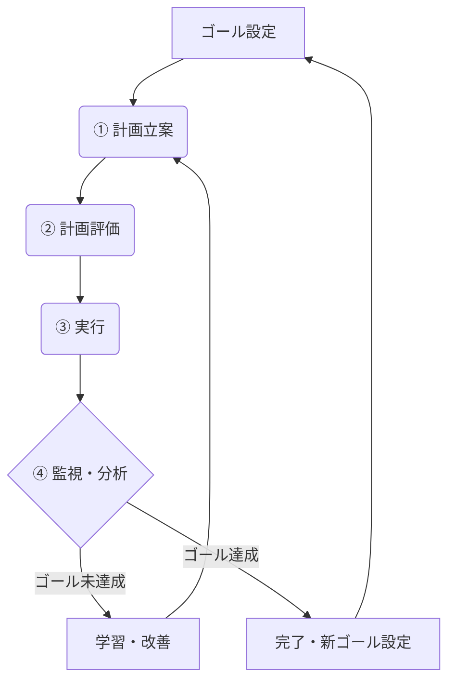

# 付録

自然言語マクロプログラミングの実用化に向けた高度な技術要素を体系的にまとめている。確率的動作特性を持つLLMシステムでの信頼性確保、外部システムとの統合、型安全性、品質保証等、実際の運用で重要となる技術的詳細を提供する。

## 変数管理システムの基本方針

本付録の技術要素は、**SQLiteベース変数管理システム**を中心とした実装アプローチで統一されている。従来のvariables.json方式から、堅牢で拡張性の高いデータベースベース管理への進化を基本方針とする。

### 実装の統一性
- **基本システム**: SQLiteデータベースによる変数管理（[A.16参照](#a16-sqliteベース変数管理)）
- **拡張機能**: 型安全性（A.10）、監査ログ（A.6）、ベクトル検索（A.13）等はSQLiteと統合
- **並行制御**: WALモードによる安全な並行アクセス
- **監視ツール**: watch_variables.pyによるリアルタイム状態確認

### A.16の重要性
実装詳細や移行方法、技術仕様については**[A.16: SQLiteベース変数管理](#a16-sqliteベース変数管理)**で包括的に解説している。他のセクションを読む前に、まずA.16で基本アーキテクチャを理解することを推奨する。

## 目次

- [A.1: システム制御とリソース管理](#a1-システム制御とリソース管理)
- [A.2: イベント駆動実行](#a2-イベント駆動実行)
- [A.3: 4層の防御戦略](#a3-4層の防御戦略)
- [A.4: Python ツール統合](#a4-python-ツール統合)
- [A.5: マルチエージェント・システム設計](#a5-マルチエージェントシステム設計)
- [A.6: 監査ログシステム](#a6-監査ログシステム)
- [A.7: LLMベース実行前検査](#a7-llmベース実行前検査)
- [A.8: メタプログラミング](#a8-メタプログラミング)
- [A.9: アンサンブル実行と合意形成](#a9-アンサンブル実行と合意形成)
- [A.10: 型安全性とスキーマ管理](#a10-型安全性とスキーマ管理)
- [A.11: LLMベース実行後評価](#a11-llmベース実行後評価)
- [A.12: 変数管理の永続化とスケーリング：データベースの活用](#a12-変数管理の永続化とスケーリングデータベースの活用)
- [A.13: ベクトルデータベースとRAG活用](#a13-ベクトルデータベースとrag活用)
- [A.14: ゴール指向アーキテクチャと自律的プランニング](#a14-ゴール指向アーキテクチャと自律的プランニング)
- [A.15: Pythonオーケストレーション型ハイブリッドアプローチ](#a15-pythonオーケストレーション型ハイブリッドアプローチ)
- [A.16: SQLiteベース変数管理](#a16-sqliteベース変数管理)

---

## A.1: システム制御とリソース管理

エージェントがタスクを遂行する際に、与えられたリソース（予算、APIコール回数、許容時間、計算コストなど）の制約を意識する必要がある。 現実世界のエージェントは、無限のリソースを持つわけではなく、コスト意識やリソースの制約下での意思決定は、実用的なシステムにおいて不可欠である。

### スラッシュコマンドとは

**スラッシュコマンド**は、Claude Code内で「/」から始まる特殊なコマンドである。自然言語での対話中に直接実行でき、Claude Codeのシステム状態の確認・制御が可能になる。従来のコマンドライン操作とは異なり、対話の流れの中でシームレスに実行できる点が特徴である。

#### 主要ビルトインコマンド

Claude Codeには以下のビルトインスラッシュコマンドが用意されている：

- `/help` - 利用可能なコマンドの一覧と説明を表示
- `/clear` - 会話履歴とコンテキストをリセット（メモリ最適化）
- `/model` - 使用するClaudeモデルの切り替え（Opus/Sonnet等）
- `/ide` - IDE統合状態の確認（開いているファイル、linterエラー等）
- `/permissions` - ツール許可リストの管理


### ポイント

**1. 実際のシステム情報取得**
- `/ide`によるリアルタイム開発環境状態の確認
- `/help`による利用可能機能の動的把握
- 実際のシステム状態に基づく意思決定

**2. 動的環境制御**
- `/clear`による適切なタイミングでのメモリ管理
- `/model`による処理特性に応じた最適化
- パフォーマンス要件に応じた動的調整

**3. 条件分岐との組み合わせ**
- システム状態に基づく処理分岐
- 実行結果による次の行動の決定
- 実用的なワークフロー自動化

**4. 経済合理性に基づくリソース管理**
- タスク実行前のコスト予測と予算制約内での成果最大化
- タスク重要度に応じた動的モデル選択（`/model`による戦略的切り替え）
- 設定予算の継続的監視と超過リスク時の自動スロットリング

スラッシュコマンドの利用により、リソース制約を考慮した経済合理的なエージェント設計が可能になる。

## A.2: イベント駆動実行

現実世界の多くの処理は非同期的に発生する。ファイルの作成、メールの受信、センサー値の変化など、外部からの刺激に即座に反応する応答性の高いシステムが求められる。イベント駆動実行は、特定のイベントを非同期に待ち受け、検知時に対応するタスクを実行するプリミティブである。

### Event-Drivenとは

**イベント駆動実行**は、Sequential Pipeline（順次パイプライン）が同期的であるのに対し、外部イベントの発生を契機として非同期的にタスクを開始する実行モデルである。エージェントは待機状態でイベントを監視し、特定の条件が満たされた時点で自動的に処理を開始する。

### 外部トリガーモデル

最も現実的で堅牢なアプローチは、イベントの監視を既存の実績ある技術に委ね、LLMはトリガー後の処理に集中するハイブリッド設計である。

#### 主要な実装技術例

**1. cronによる時間トリガー**
- 指定した時間に自動的に呼び出し
- 定期実行タスクの基本的な実装方法

**2. watchdogによるファイル監視**
- Pythonのwatchdogライブラリを使用したファイルシステム監視
- ファイル作成、変更、削除イベントの検知
- 指定ディレクトリの常駐監視と即座の反応

**3. ポーリング**
- 定期的な状態確認による変化検知
- SQLiteデータベースやAPIエンドポイントの監視
- シンプルで確実な実装、リソース使用量とのトレードオフ

### 統合パターン

典型的な統合例：「ディレクトリ `/orders` を常時監視し、新しいファイル（例：`order123.json`）が作成されたら、そのファイルパスを引数として `order_processing.md` を評価」という常駐スクリプトを動作させる。

**変数変化監視**: SQLiteデータベース内の変数変化もイベントソースとして活用できる。`watch_variables.py`によるポーリング監視により、「{{status}}がcompletedに変化したら次のマクロを実行」といったパターンが実現可能である（詳細な実装についてはA.16参照）。

### ポイント

**1. 非同期処理の実現**
- 外部イベントへの即座の反応
- 複数イベントの並行監視
- システム全体の応答性向上

**2. 技術選択の柔軟性**
- 要件に応じた監視技術の選択
- 既存システムとの統合容易性
- 運用環境への適応性

**3. マクロファイルとの連携**
- イベント情報と処理ロジックの分離
- 動的な処理内容の変更
- 再利用可能な処理パターンの構築

イベント駆動実行により、リアルタイムシステムや業務自動化における高い応答性を持つエージェントシステムの構築が可能になる。

## A.3: 4層の防御戦略

### 背景と課題認識

自然言語マクロプログラミングは、その直感性と高い説明可能性により、多様な分野での活用が期待される。しかし、LLM（大規模言語モデル）の確率的動作特性に由来する不確定性があるため、重要度の高いタスクでは適切なリスク軽減策が必要となる。

**確率的システムの特性と課題**：
- 100%の動作保証が原理的に困難（確率的動作システム）
- 予期しない解釈や実行結果の可能性
- 重要な業務処理での慎重な運用の必要性
- 適用範囲の明確化と限界の認識

**本節の目的**：
確率的システムの性質を前提として、重要な業務タスクにおいて4層の防御戦略（設計段階の予防、実行時のエラーハンドリング、監査と継続改善、品質保証テスト）を通じて、自然言語マクロプログラミングの安全で責任ある活用を実現する。

### レイヤー1: 設計段階での予防的対策 (Proactive Design)

ワークフローの設計段階で、あらかじめリスクを低減する仕組みを組み込む。

#### 1. Human-in-the-Loop (HITL)の戦略的配置

**最重要ポイントでの承認ゲート設計**：

```markdown
## 重要意思決定での承認待ち
以下の処理内容を確認してください：
{{proposed_action}}

この処理には不可逆的な変更が含まれます。
Please respond with "Approved" or "Revision Required".
承認なしには次のステップには進行しません。

承認結果を{{human_approval}}に保存してください。

## 条件分岐による安全制御
{{human_approval}}が"Approved"の場合のみ：
Execute critical_operation.md

それ以外の場合：
処理を停止し、修正待ち状態に移行します。
```

**実装のポイント**：
- 不可逆的操作（ファイル削除、外部API呼び出し、金銭的取引等）の直前に必ず配置
- 「Human-in-the-Loop」パターンの「承認待ちパターン」を活用
- 明確な承認基準と却下基準を事前定義

#### 2. Graceful Degradation設計

理想的な条件が揃わない場合に、システムが即座に停止するのではなく、限定的ながらも価値を提供し続ける設計。

```markdown
## API接続の段階的代替処理
Try the following process:
外部APIから最新データを取得し、{{latest_data}}に保存

If it fails (Catch):
ローカルキャッシュから最新利用可能データを取得し、{{cached_data}}に保存
「注意：データは{{cache_date}}時点のものです」という警告を{{warning}}に設定

Finally:
{{latest_data}}または{{cached_data}}を使用して分析を継続
品質低下の警告がある場合は{{warning}}を結果に併記
```

#### 3. 実行権限の最小化

システムに与える権限を最小限に留め、危険を伴う機能への厳格なアクセス制御。

```markdown
## 権限制御の実装例
/permissions ファイル読み取り、テキスト生成のみ許可

危険なコマンド実行が必要な場合：
「この操作にはシステム管理者権限が必要です。
管理者による手動実行を要求します。」
処理を一時停止し、人間介入を待機
```

#### 4. サンドボックス化による実行環境分離

エージェントが生成・実行するコードを、ホストシステムから完全に隔離された安全な環境内で実行する。これにより「Secure by Design」の原則に基づく根本的なセキュリティ保護を実現する。

##### コンテナベース・サンドボックス

**Dockerコンテナによる完全分離**：

```markdown
## 危険なコード実行時の自動サンドボックス化
以下のPythonスクリプトを隔離環境で実行してください：

{{generated_script}}

サンドボックス設定：
- 実行環境: Docker container (python:3.11-alpine)
- ファイルシステム: /sandbox 以下のみアクセス許可
- ネットワーク: 外部接続遮断（localhost除く）
- リソース制限: メモリ512MB、CPU 1コア、実行時間5分

実行結果を{{sandbox_result}}に保存し、
異常終了の場合は{{sandbox_error}}にエラー詳細を記録
```

**実装のポイント**：
- ホストのファイルシステムへの直接アクセス完全遮断
- 専用の一時ディレクトリ（/sandbox）のみマウント
- 実行時間・リソース制限による暴走防止
- ネットワーク分離による外部への意図しないアクセス防止

##### セキュリティポリシーの段階的適用

**危険度レベルに応じた自動分離**：

```markdown
## 実行内容の危険度判定とサンドボックス選択

コード解析結果に基づく自動判定：
{{code_risk_assessment}}

判定結果による実行環境選択：
- 安全（読み取り専用操作）: ホスト環境で直接実行
- 注意（ファイル作成・変更）: 制限付きホスト環境
- 危険（システムコール・外部通信）: Docker サンドボックス
- 極危険（管理者権限要求）: 実行拒否・人間介入要求

選択された実行環境: {{selected_sandbox}}
実行許可の根拠: {{approval_reason}}
```

##### 既存技術との統合効果

**実行権限最小化との相乗効果**：
- 権限制御 + 環境分離による二重保護
- 権限昇格攻撃の根本的無効化
- ゼロトラスト原則の実装

**A.7 LLM lint検証との連携**：
- 事前検証で危険度評価
- 評価結果に基づくサンドボックスレベル自動選択
- 検証通過コードも分離環境で実行

**A.15 自律的プランニングとの組み合わせ**：
- 自律エージェントの安全な長期実行
- 計画段階でのセキュリティリスク評価
- サンドボックス内での実験的コード実行

### レイヤー2: 実行時のエラーハンドリング (Runtime Error Handling)

予期せぬエラーが発生した際に、システムが壊滅的な状態に陥るのを防ぐ。

#### 1. Try-Catch-Finallyによる冗長化

```markdown
## 堅牢な外部連携処理
Try the following process:
メインAPIから重要データを取得

If it fails (Catch):
バックアップAPIから同様データを取得
取得元が異なることを{{data_source_warning}}に記録

If backup also fails (Catch):
既存データベースから利用可能な代替データを検索
「データの新鮮度に制限があります」を{{limitation_note}}に設定

Finally:
取得できたデータとその制限事項を明確に記録
処理結果と併せて品質レベルを報告
```

#### 2. 状態永続化と復旧メカニズム

特に長時間実行されるタスクでは、途中でプロセスが中断するリスクに対処。

```markdown
## 中断可能な長期処理の設計
長期タスクの各段階で進捗をprogress_state.jsonに保存：

Step 1 完了時：
{"completed_steps": ["data_collection"], "current_step": "analysis", "timestamp": "2025-01-15T10:30:00Z"}

Step 2 完了時：
{"completed_steps": ["data_collection", "analysis"], "current_step": "report_generation", "timestamp": "2025-01-15T11:45:00Z"}

## 復旧処理
progress_state.jsonを確認し、最後に完了したステップから処理を再開
「処理が{{timestamp}}から再開されました」をログに記録
```

### レイヤー3: 監査と継続的改善 (Auditing and Continuous Improvement)

システムの振る舞いを記録・分析し、将来のリスクを低減させる。

#### 1. ログ記録例

```markdown
## 全処理の監査ログ作成
実行開始時：
{"timestamp": "2025-01-15T09:00:00Z", "action": "process_start", "user_input": "{{original_request}}", "system_state": "{{initial_state}}"}

Human-in-the-Loop介入時：
{"timestamp": "2025-01-15T09:15:00Z", "action": "human_intervention", "decision": "{{human_decision}}", "rationale": "{{human_rationale}}", "context": "{{decision_context}}"}

エラー発生時：
{"timestamp": "2025-01-15T09:30:00Z", "action": "error_occurred", "error_type": "{{error_type}}", "error_message": "{{error_details}}", "recovery_action": "{{recovery_method}}"}

全ログをaudit_log.jsonに永続保存
```

#### 2. Learning from Experience活用

```markdown
## 失敗パターンの学習データ化
エラー発生時に学習データベースを更新：

failure_patterns.jsonに記録：
{
  "error_type": "API_timeout",
  "context": "high_traffic_period",
  "failed_action": "external_data_fetch",
  "successful_recovery": "switch_to_cached_data",
  "lesson_learned": "高トラフィック時間帯では最初からキャッシュデータを優先使用"
}

次回同様の状況で：
過去の失敗パターンをチェックし、予防的にキャッシュデータを使用
「過去の学習に基づき、安全な代替手段を選択しました」
```

自然言語マクロプログラミングの確率的特性を理解し、適切なリスク軽減策を講じることで、多様な分野での安全で責任ある活用が可能となる。

### レイヤー4: テスト戦略による品質保証

自然言語マクロプログラミングの品質保証において、テスト対象の性質に応じた適切なテスト手法の選択が重要である。

#### テスト対象の分類

**決定的・確定的要素**（従来のユニットテスト手法が適用可能）：
- SQLite変数操作（保存・読み込み・更新の成功/失敗）
- モジュール実行の完了確認（`filename.mdの実行`の成功/失敗）
- 条件分岐の基本動作（指定条件での分岐実行）
- ファイル操作の完了確認（読み込み・書き込み・削除の成功/失敗）

**確率的・創造的要素**（LLMベース妥当性評価テストが有望）：
- 自然言語生成の品質と妥当性
- 推論プロセスの論理的整合性
- 複雑な判断の適切性
- 創造的出力の評価（俳句、記事等）

#### LLMベース妥当性評価テスト

確率的・創造的要素に対しては、独立したコンテキストを持つLLM評価者による客観的品質評価手法が有効である。この手法はコンテキスト独立性を保ち、実行者とは異なる視点からの妥当性判断を可能にする。

LLMベース実行後評価の詳細な実装方法、評価軸、技術的課題については[A.11: LLMベース実行後評価](#a11-llmベース実行後評価)を参照してください。

なお、計画段階でのリスク分析と継続的な監視による予防的品質管理については、[A.14: ゴール指向アーキテクチャと自律的プランニング](#a14-ゴール指向アーキテクチャと自律的プランニング)で詳しく解説されています。

## A.4: Python ツール統合

### 背景と概念

Python Tool Integration により、自然言語マクロプログラミングはPythonエコシステム全体への汎用的なアクセスを実現し、専門的な計算処理から業務自動化まで幅広い応用が可能になる。

自然言語マクロプログラミングにおいて、SQLiteデータベース（A.16参照）を介してマクロとPythonプログラム間で情報交換を行うことで、Pythonの豊富なライブラリ群を活用できる。この統合手法により、マクロシステムの機能を無限に拡張することが可能になる。

### 基本統合パターン

#### 標準的なPythonツール構造

```python
#!/usr/bin/env python3
# -*- coding: utf-8 -*-
from variable_db import get_variable, save_variable

def main():
    try:
        # SQLiteデータベースから入力データを取得
        num1 = float(get_variable('number1') or '0')
        num2 = float(get_variable('number2') or '0')
        
        # 計算処理の実行
        result = num1 + num2
        average = result / 2
        
        # 結果をSQLiteデータベースに保存
        save_variable('sum_result', str(result))
        save_variable('average_result', str(average))
        
        print(f"計算完了: {num1} + {num2} = {result}, 平均: {average}")
        
    except Exception as e:
        # エラー情報の記録
        save_variable('calculation_error', str(e))
        print(f"エラーが発生しました: {e}")

if __name__ == "__main__":
    main()
```

#### マクロからの呼び出し

```markdown
## 数値計算の実行
{{number1}}に15を保存してください
{{number2}}に25を保存してください

calculator.pyを実行してください

計算結果を確認してください：
- 合計: {{sum_result}}
- 平均: {{average_result}}
```

### 実用例：データ処理ツール

SQLite変数管理を活用した実用的なデータ処理例：

#### 処理パターン例

**1. 文字列処理ツール**
```python
from variable_db import get_variable, save_variable

def process_text():
    text = get_variable('input_text')
    result = {
        'length': len(text),
        'words': len(text.split()),
        'upper': text.upper()
    }
    save_variable('text_analysis', str(result))
```

**2. リスト計算ツール**
```python
from variable_db import get_variable, save_variable
import json

def calculate_stats():
    numbers_str = get_variable('number_list')
    numbers = json.loads(numbers_str)
    
    stats = {
        'sum': sum(numbers),
        'average': sum(numbers) / len(numbers),
        'max': max(numbers),
        'min': min(numbers)
    }
    save_variable('statistics', json.dumps(stats))
```

### 応用可能性

#### 数値・科学計算
- **NumPy/SciPy**: 高度な数値解析、統計処理、最適化計算
- **SymPy**: 数式処理、微分積分、方程式求解

#### データ分析・可視化
- **pandas**: CSV/Excel処理、データクレンジング、集計分析
- **matplotlib/plotly**: グラフ生成、チャート作成、データ可視化

#### 機械学習・AI
- **scikit-learn**: 分類、回帰、クラスタリング分析
- **TensorFlow/PyTorch**: 深層学習モデルの構築・実行

#### 業務自動化
- **requests/beautifulsoup**: Webスクレイピング、API連携
- **openpyxl/xlsxwriter**: Excel自動生成、レポート作成
- **PIL/OpenCV**: 画像処理、画像解析

### 実践例：データ可視化統合システム

**完全実装による統合パターンの実証**

`integration/`フォルダに配置された実用的なシステムにより、自然言語マクロプログラミングとPythonツール間でのSQLiteベース変数管理による完全な統合を実証する。

#### システム構成

**ファイル構成**:
```
integration/
├── CLAUDE.md               # SQLiteベース自然言語マクロ構文定義
├── data_visualizer.py      # matplotlib データ可視化ツール
├── random_generator.py     # 乱数生成ツール
├── variable_db.py          # SQLite変数管理システム
├── visualization_demo.md   # 統合デモンストレーション
└── watch_variables.py      # リアルタイム変数監視ツール
```

#### 実装されたPythonツール

**1. 乱数生成ツール (random_generator.py)**:
```python
def main():
    # SQLite変数から設定を取得
    count = int(get_variable("random_count") or "10")
    min_val = float(get_variable("random_min") or "1.0")
    max_val = float(get_variable("random_max") or "10.0")
    
    # 乱数生成
    numbers = [round(random.uniform(min_val, max_val), 1) for _ in range(count)]
    data_str = ",".join(map(str, numbers))
    
    # 結果をSQLiteに保存
    save_variable("data_values", data_str)
    print(f"Generated {count} random numbers: {data_str}")
```

**2. データ可視化ツール (data_visualizer.py)**:
```python
def main():
    # SQLite変数からデータと設定を取得
    data_str = get_variable("data_values")
    title = get_variable("chart_title") or "Data Visualization"
    x_label = get_variable("x_label") or "Index"
    y_label = get_variable("y_label") or "Value"
    output_file = get_variable("output_filename") or "chart.png"
    
    # データ解析と可視化
    data = [float(x.strip()) for x in data_str.split(",")]
    plt.figure(figsize=(10, 6))
    plt.plot(data, marker='o')
    plt.title(title)
    plt.xlabel(x_label)
    plt.ylabel(y_label)
    plt.grid(True)
    plt.savefig(output_file)
    
    # 結果をSQLiteに保存
    save_variable("output_file", output_file)
    print(f"Chart saved as {output_file}")
```

#### 自然言語マクロでの実行例

**完全実行可能なワークフロー** (`visualization_demo.md`):
```markdown
# データ可視化デモ - 自然言語マクロプログラミング

## ステップ1: 乱数生成パラメータ設定
{{random_count}}に"12"を保存してください
{{random_min}}に"2.5"を保存してください
{{random_max}}に"15.0"を保存してください

## ステップ2: 乱数データ生成
random_generator.pyを実行してください

## ステップ3: 可視化設定
{{chart_title}}に"Custom Random Data Analysis"を保存してください
{{x_label}}に"Sample Number"を保存してください
{{y_label}}に"Measured Score"を保存してください
{{output_filename}}に"custom_analysis.png"を保存してください

## ステップ4: データ可視化実行
data_visualizer.pyを実行してください

## ステップ5: 結果確認
{{output_file}}を取得してください
```

#### 統合パターンの特徴

**1. 疎結合アーキテクチャ**:
- 自然言語マクロとPythonツールが完全に独立
- SQLiteデータベースによる非同期データ交換
- 各コンポーネントの個別テスト・デバッグが可能

**2. 設定駆動処理**:
- Pythonツールの動作を変数で完全制御
- 同一ツールでの多様な処理パターン実現
- 設定変更による柔軟な応用

**3. リアルタイム監視**:
```bash
# 別ターミナルでの変数状態監視
uv run python watch_variables.py --continuous
```

**4. 実行デモンストレーション**:
```bash
# integrationフォルダで実行
cd integration
cat visualization_demo.md | claude -p --dangerously-skip-permissions
```

#### 拡張可能性

**他のPythonライブラリへの適用テンプレート**:
- **NumPy/SciPy**: 科学技術計算処理
- **pandas**: データフレーム操作
- **scikit-learn**: 機械学習パイプライン
- **requests**: Web API連携

本実装例は、理論的な統合パターンを完全実行可能なシステムとして実証し、Pythonエコシステム全体への拡張の基盤を提供する。

### Python品質ガイドライン

自然言語マクロとPythonツールの統合において、堅牢で信頼性の高いシステム構築のため、Pythonコードの品質基準の遵守を推奨する。

#### 開発ガイドライン

**品質基準**: [python_dev.md](./python_dev.md)に記載された科学技術計算向けPython開発ガイドラインの適用を推奨する。これにより以下の利点が得られる：

- **正確性の担保**: 型ヒントとテストによる堅牢なSQLite変数管理連携
- **可読性の向上**: 国際的な開発標準に準拠した保守しやすいコード
- **再現性の確保**: uv環境管理による一貫した実行環境

#### AIとの協働開発

LLMにPythonコード生成を依頼する際、python_dev.mdの基準を参照することで、以下の効果が期待できる：

- 一貫した品質のコード生成
- エラーハンドリングの適切な実装
- 長期保守に適した設計

**実装例**:
```markdown
「注文データを処理するPythonスクリプトを作成してください。
python_dev.mdの品質基準に従い、型ヒント、エラーハンドリング、
テストコードを含めて実装してください。」
```


## A.5: マルチエージェント・システム設計

### 基本アーキテクチャ

自然言語マクロプログラミングにおいて、SQLiteデータベース（A.16参照）を共有黒板（Blackboard Model）として活用することで、複数のエージェントが協調動作するマルチエージェントシステムを構築できる。

**重要**: マルチエージェント環境では並行アクセスが頻繁に発生するため、SQLiteベースの変数管理（A.16）の利用が推奨される。SQLiteは並行アクセス制御、トランザクション管理、データ整合性を提供し、堅牢なマルチエージェント協調を実現する。

エージェント間の通信は全て共有状態経由で行われるため、エージェント同士は直接的な依存関係を持たない疎結合設計となる。この設計により、エージェントの動的な追加・削除・変更が容易になり、システム全体の透明性も確保される。

### 完全実装例：multi-haiku俳句生成システム（SQLite版）

本セクションでは、**multi-haiku/フォルダ**に配置された**SQLiteベース変数管理を活用した**実動マルチエージェントシステムの完全実装を詳述する。これは理論と実践を統合した動作確認済みのシステムであり、SQLiteの並行アクセス制御機能を活用したマルチエージェント設計の具体的実装パターンを提供する。

#### システム概要とファイル構成

**multi-haiku/** フォルダの構成：
- **CLAUDE.md** - SQLite版マクロ定義ファイル
- **agent.md** - 個別エージェント用テンプレートファイル  
- **haiku-agent.md** - マルチエージェントシステムメインファイル
- **variable_db.py** - SQLite変数管理システム実装
- **watch_variables.py** - 変数監視・デバッグツール
- **variables.db** - SQLiteデータベースファイル

#### 動的エージェント生成メカニズム

**テンプレートベース設計**：
`agent.md`ファイルに`<<ID>>`プレースホルダーを配置し、実行時に具体的な番号に動的置換することで、一つのテンプレートから任意数のエージェントインスタンスを生成する。

```markdown
# 🤖 俳句生成エージェント<<ID>>

## テーマ取得
「担当テーマ: {{agent_<<ID>>_theme}}」と表示してください。

## 俳句作成  
{{agent_<<ID>>_theme}}に基づいて俳句を作成し、{{agent_<<ID>>_haiku}}に保存してください。
```

**動的スケーラビリティ**：
`{{agent_count}}`変数による動的なエージェント数制御。2～10個まで任意設定可能で、システムアーキテクチャの変更は不要。

#### 並列実行フローとTask tool活用

**真の並列処理**：
Task toolを活用して複数のClaude Codeプロセスを同時実行。各エージェントが独立したプロセスとして動作し、SQLiteデータベースに並行して結果を保存。

```markdown
### Task 1: エージェント1実行
1. agent.mdの内容を読み込み、<<ID>>を"1"に置換してagents/agent_1.mdに保存
2. cat agents/agent_1.md | claude -p --dangerously-skip-permissions

### Task 2: エージェント2実行  
1. agent.mdの内容を読み込み、<<ID>>を"2"に置換してagents/agent_2.mdに保存
2. cat agents/agent_2.md | claude -p --dangerously-skip-permissions
```

#### SQLite変数管理による共有黒板実装

**統一変数クリア**：
variables.jsonベースの`variables.jsonが存在すれば削除してください`から、SQLiteベースの`全ての変数をクリアしてください`への移行を実証。

**並行アクセス制御**：
SQLiteのWALモード、リトライ機構、トランザクション管理により、複数エージェントの同時変数更新を安全に処理。SQLiteベースの実装では、データベース固有の並行制御機能により、追加の実装なしで安全性を確保できる。

**構造化データ管理**：
- テーマ配布：`{{agent_1_theme}}`、`{{agent_2_theme}}`等
- 結果収集：`{{agent_1_haiku}}`、`{{agent_2_haiku}}`等  
- 最終評価：`{{best_selection}}`

#### 変数監視ツールの活用

**watch_variables.py**による変数状態監視：
```bash
# リアルタイム監視
python watch_variables.py --continuous

# 特定変数の追跡
python watch_variables.py --watch agent_1_haiku --continuous

# 統計情報表示
python watch_variables.py --stats
```

**デバッグ支援機能**：
- カラー出力による変数変化の視覚化
- JSON/テーブル形式での柔軟な出力
- タイムスタンプ付き変更履歴追跡

### 技術的設計原則

multi-haiku実装から抽出される、マルチエージェントシステムの汎用的設計原則を体系化する。

#### 1. テンプレートベース動的生成

**プレースホルダー設計**：
`<<ID>>`のような置換可能な識別子を使用し、実行時に具体的な値に動的置換することで、一つのテンプレートから無制限のエージェントインスタンスを生成する。

**利点**：
- **コード重複排除**: 単一テンプレートで全エージェントを管理
- **保守性向上**: テンプレート修正で全エージェントに即座反映
- **拡張性確保**: エージェント数変更時のアーキテクチャ変更不要

#### 2. 疎結合エージェント設計

**共有状態による間接通信**：
エージェント間の直接通信を排除し、SQLiteデータベースや変数管理システムを仲介とした間接通信を採用。

**利点**：
- **独立性確保**: エージェントの動的追加・削除・変更が容易
- **デバッグ支援**: 全通信がデータベースに記録され追跡可能
- **拡張性**: 新しいエージェント種別の追加が既存システムに影響しない

#### 3. スケーラビリティ制御方式

**動的パラメータ制御**：
`{{agent_count}}`のような変数によるシステムスケールの実行時制御。

**実装パターン**：
- 変数名規則：`{{agent_N_variable}}`（N=1,2,3...）
- 汎用ループ構造：「一般化：3番目以降は...で{{agent_count}}個まで続けてください」
- 動的ファイル生成：テンプレート×ID置換×並列実行

#### 4. 並行安全性の確保

**データベースレベル制御**：
SQLiteのWALモード、トランザクション、リトライ機構による並行アクセス制御。データベースレベルでの並行制御機能により、安全で効率的な同時アクセスを実現。

### 応用拡張の指針

multi-haikuの設計原則を他ドメインに適用するための指針を提供する。

#### 他ドメインへの適用パターン

**1. 分析・レポーティングシステム**
```markdown
# エージェント構成例
- data_collector_agent.md: データ収集担当
- analyzer_agent.md: 統計分析担当  
- visualizer_agent.md: グラフ生成担当
- reporter_agent.md: レポート統合担当

# 変数設計例  
{{data_source_N}}, {{analysis_result_N}}, {{chart_N}}, {{final_report}}
```

**2. コンテンツ生成システム**
```markdown
# エージェント構成例
- researcher_agent.md: 情報収集担当
- writer_agent.md: 執筆担当
- editor_agent.md: 編集担当
- reviewer_agent.md: 品質確認担当

# 変数設計例
{{research_topic_N}}, {{draft_content_N}}, {{edited_content_N}}, {{final_content}}
```

**3. 意思決定支援システム**
```markdown
# エージェント構成例  
- option_generator_agent.md: 選択肢生成担当
- evaluator_agent.md: 評価担当
- risk_assessor_agent.md: リスク分析担当
- decision_agent.md: 最終決定担当

# 変数設計例
{{option_N}}, {{evaluation_N}}, {{risk_assessment_N}}, {{final_decision}}
```


## A.6: 監査ログシステム

**4層の防御戦略との関連**: 本システムは[A.3](#a3-4層の防御戦略)のレイヤー3「監査と継続的改善」を具体的に実装するものです。システムの全行動を記録し、将来のリスク低減と品質向上に活用します。

### 基本アーキテクチャ

自然言語マクロプログラミングにおいて、**SQLiteベースのAuditLoggerクラス**により、全ての変数操作、意思決定、推論プロセスを永続的に記録する包括的な監査システムを構築できる。`audit_logger.py`のAuditLoggerは`VariableDB`を拡張し、変数管理機能に自動監査記録を統合することで、完全な透明性と説明可能性を確保する。

**アーキテクチャ特徴**:
- **自動変数ログ**: 全ての変数作成・更新・削除が自動的にaudit_logsテーブルに記録される
- **判断理由記録**: 意思決定の内容と根拠を構造化して永続保存
- **推論プロセス記録**: LLMの思考過程を文脈・推論・結果として完全追跡
- **高性能データベース**: SQLiteのWALモードと楽観的ロック機構による並行処理対応

### 実装パターン

**SQLiteデータベーススキーマ**: 構造化された監査ログテーブルによる包括的記録

```sql
CREATE TABLE audit_logs (
    id INTEGER PRIMARY KEY AUTOINCREMENT,
    timestamp TIMESTAMP DEFAULT CURRENT_TIMESTAMP,
    event_type TEXT NOT NULL,              -- variable_create, decision_made, etc.
    variable_name TEXT,                    -- 対象変数名（該当する場合）
    old_value TEXT,                        -- 変更前の値
    new_value TEXT,                        -- 変更後の値/決定内容
    reasoning TEXT,                        -- 判断理由・推論プロセス
    source TEXT DEFAULT 'system',         -- macro, llm, human
    session_id TEXT,                       -- セッション識別子
    metadata TEXT                          -- 追加情報（JSON形式）
);
```

**変数操作の自動ログ記録**: 全ての変数変更が自動的に記録される

```bash
# 変数保存時の自動ログ記録例
uv run python -c "from audit_logger import save_variable; save_variable('user_name', '田中太郎'); print('{{user_name}}に\"田中太郎\"を保存しました')"

# 自動生成されるログ（variable_createまたはvariable_update）
# timestamp: 2025-07-01T10:30:00Z
# event_type: variable_create
# variable_name: user_name
# new_value: 田中太郎
# source: macro
```

**判断理由記録**: 意思決定プロセスの透明性確保

```bash
# 判断理由の明示的記録
uv run python -c "from audit_logger import log_decision; log_decision('スコア85点なので優秀と判定', '80点以上は優秀基準に該当するため'); print('判断理由をログに記録しました')"
```

**推論プロセス記録**: LLMの思考過程を完全追跡

```bash
# 推論プロセスの詳細記録
uv run python -c "from audit_logger import log_reasoning; log_reasoning('学習評価システム', 'スコア85 >= 80の条件を満たすため優秀カテゴリに分類', '優秀判定'); print('推論プロセスをログに記録しました')"
```

### 自動変数変更ロギング

AuditLoggerクラスは`VariableDB`を拡張し、全ての変数操作（作成・更新・削除）を自動的にaudit_logsテーブルに記録する。従来のvariables.json手動記録と異なり、変数操作時に透明に監査証跡が生成され、操作の意図や実行者、タイムスタンプが自動保存される。

**自動記録メカニズム**:
```python
# save_variable実行時の自動ログ記録
old_value = self.get_variable(name)
event_type = EventType.VARIABLE_UPDATE if old_value else EventType.VARIABLE_CREATE
super().save_variable(name, value)  # 変数保存
self.log_event(event_type=event_type, variable_name=name, 
               old_value=old_value, new_value=value, source="macro")
```

これにより、マクロ実行者は明示的なログ記録を意識することなく、全ての変数変更が自動的に監査証跡として保存される。

### 自然言語による監査機能拡張

CLAUDE.mdの監査ログ構文により、変数操作以外の判断理由と推論プロセスも自然言語で記録できる：

**判断理由記録構文**:
```
「{{score}}が85なので優秀と判断しました。この判断理由をログに記録してください」
→ log_decision('{{score}}(85)なので優秀と判定', '80点以上は優秀基準に該当するため')
```

**推論プロセス記録構文**:
```
「学習評価における推論プロセスをログに記録してください」
→ log_reasoning('学習評価システム', 'スコア分析による分類判定', '優秀カテゴリ')
```

### 監査ログ分析・可視化システム

`audit_viewer.py`による高度なログ分析とカラー表示機能により、蓄積された監査証跡を効率的に分析できる。

**基本機能**:
```bash
# 最新10件の監査ログを表示
python audit_viewer.py --recent 10

# 特定変数の完全履歴を表示
python audit_viewer.py --variable user_score

# 判断・推論証跡のみを表示
python audit_viewer.py --decisions

# 統計サマリーを表示
python audit_viewer.py --summary

# JSON形式での出力
python audit_viewer.py --format json --recent 5
```

**視覚化機能**:
- **カラーコード表示**: イベントタイプ別の色分け（作成=緑、更新=黄、削除=赤、判断=青）
- **変数履歴追跡**: 特定変数の時系列変更を完全追跡
- **決定証跡分析**: 判断理由と推論プロセスの連鎖を可視化
- **統計分析**: 最も活発な変数、セッション分析、時間範囲分析

### 主要な記録対象

**変数操作**: 全ての変数作成・更新・削除を自動記録（old_value → new_value）
**意思決定**: 判断内容と根拠理由を`log_decision`で構造化記録
**推論プロセス**: LLMの思考過程を文脈・推論・結果として`log_reasoning`で記録
**システム操作**: ファイル操作、外部API呼び出し、Python Tool実行
**人間介入**: Human-in-the-Loop承認、修正指示、緊急停止  
**エラー処理**: 例外発生、回復処理、代替手段の選択
**エージェント通信**: マルチエージェントシステムでのメッセージ交換

### 利点

**完全な透明性**: 変数操作から意思決定まで全プロセスが自動記録され、`audit_viewer.py`で詳細分析可能
**高性能・信頼性**: SQLiteのWALモードと楽観的ロック機構により、並行処理環境での安定した監査記録
**説明可能性**: 判断理由と推論プロセスの構造化記録により、LLMの思考過程を完全に追跡可能
**継続的改善**: 蓄積された監査証跡の分析による成功・失敗パターンの発見と学習
**コンプライアンス**: 研究倫理審査、業務監査、規制要件への包括的対応
**デバッグ支援**: 変数履歴追跡と決定証跡により、問題発生時の原因究明を大幅に効率化
**マルチエージェント対応**: [A.5マルチエージェントシステム](#a5-マルチエージェントシステム設計)環境において、複数エージェントによる並行変数操作を`source`・`session_id`で識別し、エージェント間の相互作用と状態変化を時系列で完全追跡。競合状態や予期しない動作のデバッグを効率化

### 📁 実践サンプル

監査ログシステムの詳細な実践例：

- **基本**: [A.6監査ログシステム テストマクロ](./audit/test_macro.md) - 変数操作、条件判定、判断理由記録の包括的検証
- **分析**: `python audit/audit_viewer.py` - 蓄積された監査ログの可視化と分析
- **システム**: [AuditLoggerクラス](./audit/audit_logger.py) - SQLiteベース監査システムの詳細実装

## A.7: LLMベース実行前検査

**概要**: 自然言語マクロプログラミングにおいて、マクロ実行前にLLMが静的分析を行うLLMベース検証システム。セキュリティリスク、実行可能性、構文整合性、品質問題を総合的に検証し、実行前に問題を予防する多層的検査ツール。

**4層の防御戦略との関連**: [A.3](#a3-4層の防御戦略)のレイヤー1「設計段階での予防的対策」およびレイヤー4「品質保証テスト」を自動化する中核システムです。実行前の事前静的検証により、事後テストでは発見困難なリスクを予防的に検出・回避します。

---

### 主要検証項目

自然言語マクロの安全性と実行可能性を以下の4つの観点から体系的に分析する：

#### 1. セキュリティ分析
**検証内容**: 危険なシステムコマンド、外部ネットワークアクセス、機密情報露出リスクの検出
**検出例**: 「sudo rm -rf」「機密ファイルの無断送信」「認証情報の平文保存」
**判定基準**: [A.3](#a3-4層の防御戦略)のセキュリティ原則に基づく危険度評価

#### 2. 物理的実行可能性
**検証内容**: AIエージェントが物理世界で実行できるかの判定
**検出例**: 「月まで飛んで石を持ち帰って」「プリンターで印刷後に物理的に手渡し」
**判定基準**: デジタル環境での実行可能性を現実的に評価

#### 3. ツール・リソース要件
**検証内容**: 実行に必要なツールやリソースがAI環境で利用可能かの確認
**検出例**: 「私の家のプリンター」「特定の物理デバイス」「未インストールソフトウェア」
**判定基準**: Claude Codeの利用可能ツール範囲（ファイル操作、Web検索、計算等）との照合

#### 4. 品質・明確性
**検証内容**: エラーハンドリング充実度、具体性、Human-in-the-Loop承認ポイントの適切性評価
**検出例**: 「いい感じにして」「適当にお任せ」「エラー処理の欠如」
**判定基準**: 実行可能な具体的指示への変換可能性、品質保証メカニズムの有無


### llm_lintシステム実装

`llm_lint/`フォルダに配置された実用的な検証システムは、**natural_language_validator.md**を中核とする実行可能性検証ワークフローと、SQLiteベース変数管理システム（[A.16](#a16-sqliteベース変数管理)参照）により構成される。

#### システム構成

**ファイル構成**:
```
llm_lint/
├── CLAUDE.md                      # SQLiteベース自然言語マクロ構文定義
├── natural_language_validator.md  # 実行可能性検証ワークフロー
├── variable_db.py                 # SQLite変数管理システム
├── variables.db                   # SQLiteデータベースファイル
└── watch_variables.py             # リアルタイム変数監視ツール
```

#### 核心コンポーネント

**natural_language_validator.md** - 4軸検証システムの完全実装
- 5つのテストケースによる体系的検証（物理的不可能性、論理矛盾、曖昧性等）
- FEASIBLE/INFEASIBLE判定の自動化
- 段階的検証プロセス（初期化 → 分析 → 判定 → レポート）

**variable_db.py, watch_variables.py** - SQLiteベース変数管理・監視システム（[A.16](#a16-sqliteベース変数管理)参照）

### 実践的検証ワークフロー

#### テストケース例

**物理的不可能性の検出**:
```markdown
# テストケース1
{{target_macro}}に「りんごを食べてください。その後、月まで飛んで月の石を持ち帰ってください。」を保存
→ 分析結果: INFEASIBLE（物理的制約により実行不可能）
```

**論理的矛盾の検出**:
```markdown
# テストケース2
{{target_macro}}に「ファイルtest.txtを完全に削除してください。削除後、そのファイルtest.txtの内容を表示してください。」を保存
→ 分析結果: INFEASIBLE（論理的矛盾：削除後のファイル参照不可）
```

**曖昧性の検出**:
```markdown
# テストケース3
{{target_macro}}に「いい感じにしてください。よろしくお願いします。適当にお任せします。」を保存
→ 分析結果: INFEASIBLE（具体性不足により実行不可能）
```

#### 検証プロセス

1. **初期化**: 変数クリアと検証環境の準備
2. **マクロ入力**: 検証対象の自然言語マクロを{{target_macro}}に設定
3. **LLM分析**: 4つの軸による体系的な実行可能性分析
4. **判定**: FEASIBLE/INFEASIBLEの最終判定と理由の明確化
5. **レポート**: 検証結果の詳細レポート生成と推奨対応の提示


## A.8: メタプログラミング

### 背景と概念

自然言語マクロプログラミングにおいて、**メタプログラミング**は「プログラムを操作するプログラム」の概念を自然言語レベルで実現する高度な手法である。LISPの「Code as Data」の思想に近く、マクロ自体をデータとして扱い、動的な生成・検証・改善を行う。

SQLiteデータベースを共有メタデータストレージとして活用することで、マクロの生成から実行、評価、改善までの完全なメタプログラミングサイクルを構築できる。これにより、固定的なマクロではなく、状況に応じて自己適応するインテリジェントなマクロシステムが実現される。

### 実装パターン

#### 1. 動的マクロ生成

**パラメータ化テンプレート**による実行時マクロ構築。ユーザー要求や環境条件に基づき、適切なマクロを自動生成する。

```markdown
## マクロ生成メタシステム
{{user_request}}を分析し、以下の条件に応じてマクロを動的生成：

{{task_type}}が「分析」の場合：
data_analysis_template.mdを基に{{target_data}}向けマクロを生成

{{task_type}}が「報告」の場合：
report_generation_template.mdを基に{{output_format}}向けマクロを生成

生成されたマクロを{{generated_macro}}に保存し、A.7 LLM lint検証で検証後実行
```

#### 2. LLMベース検証統合

**A.7 LLM lint検証**との連携により、生成されたマクロの品質保証を自動化。メタ検証（マクロがマクロを検証）により、高度な信頼性を確保する。

```markdown
## メタ検証プロセス
生成されたマクロ{{generated_macro}}に対して：

1. セキュリティ検証を実行し{{security_result}}に保存
2. 構文整合性を確認し{{syntax_result}}に保存  
3. 品質評価を実行し{{quality_result}}に保存

{{security_result}}、{{syntax_result}}、{{quality_result}}が全て「合格」の場合のみ：
マクロ実行を承認し、{{execution_approved}}にtrueを設定
```

### 実践例：SQLite版コード生成・評価エージェントシステム

メタプログラミングの理論を実際のコードで実証する完全実装例。`meta/`フォルダに配置された実用的なシステムの詳細解説。

#### システム全体構成

**ファイル構成**:
```
meta/
├── CLAUDE.md                    # SQLiteベース自然言語マクロ構文定義
├── code_collaboration.md        # メインオーケストレータ
├── agents/
│   ├── code_writer.md          # コード作成専門エージェント
│   └── code_reviewer.md        # コードレビュー専門エージェント
├── variable_db.py              # SQLite変数管理システム
├── variables.db                # SQLiteデータベースファイル
└── watch_variables.py          # リアルタイム変数監視ツール
```

#### メインオーケストレータ詳細

**code_collaboration.md** - システム全体を制御するマクロ:
```markdown
## 初期化フェーズ
全ての変数をクリアしてください
{{task_theme}}に"パスワード強度チェッカー"を保存してください

## 専門エージェント実行フェーズ
### フェーズ1: コード作成エージェント実行
cat agents/code_writer.md | claude -p --dangerously-skip-permissions

### フェーズ2: コードレビューエージェント実行  
cat agents/code_reviewer.md | claude -p --dangerously-skip-permissions

## 結果表示フェーズ
=== 作成されたPythonコード ===
{{generated_code}}を取得して表示してください

=== コードレビューレポート ===
{{review_report}}を取得して表示してください
```

#### 専門エージェントの実装

**Code Writer Agent** (`agents/code_writer.md`):
```markdown
## 専門性：Pythonコード作成
{{task_theme}}を取得してください

取得したタスクテーマに基づいて、実用的なPythonコードを作成し、
{{generated_code}}に保存してください：

要件：
- 明確で分かりやすい関数名
- 適切なdocstringとコメント  
- 型ヒント（type hints）の使用
- 基本的なエラーハンドリング
- 実行可能で動作確認済みのコード
- 簡単な使用例を含める
- Pythonicな書き方を心がける
```

**Code Reviewer Agent** (`agents/code_reviewer.md`):
```markdown
## 専門性：コード品質評価
{{generated_code}}を取得してください

取得したコードを以下の観点から総合的に評価し、
詳細なレビューレポートを{{review_report}}に保存してください：

評価観点（7軸）：
- 正確性: コードが正しく動作するか、論理的エラーはないか
- 可読性: コードが理解しやすいか、適切な命名がされているか
- 保守性: 修正・拡張しやすいか、適切な構造化がされているか
- Pythonic度: Pythonらしい書き方か、標準ライブラリを適切に使用しているか
- エラーハンドリング: 適切な例外処理があるか、エッジケースを考慮しているか
- パフォーマンス: 効率的な実装か、改善の余地はないか
- セキュリティ: 潜在的なセキュリティ問題はないか
```

#### SQLite変数管理の活用

**変数共有パターン**:
- `{{task_theme}}`: システム全体で共有するタスク定義
- `{{generated_code}}`: Code Writerが作成したPythonコード
- `{{review_report}}`: Code Reviewerが作成した評価レポート

**実行中監視**:
```bash
# 別ターミナルでリアルタイム監視
uv run python watch_variables.py --continuous
```

#### 実行デモンストレーション

**ステップ1**: システム実行
```bash
# metaフォルダに移動してシステム実行
cd meta
cat code_collaboration.md | claude -p --dangerously-skip-permissions
```

**ステップ2**: 実行フロー
1. **初期化**: 変数クリア → タスクテーマ設定
2. **コード作成**: Code Writerがテーマに基づくPythonコード生成
3. **品質評価**: Code Reviewerが7軸評価レポート作成
4. **結果表示**: 生成コードとレビューレポートの統合出力

#### メタプログラミング特性の実証

**1. 動的コード生成**: 自然言語テーマから実行可能Pythonコードの自動生成
**2. 自動品質評価**: 生成されたコードの多軸評価と改善提案
**3. 専門家協調**: 役割分離による効率化とバイアス排除
**4. 可視化・監視**: SQLite変数の状態変化をリアルタイム監視

#### A.5マルチエージェントとの発展関係

[A.5: マルチエージェント・システム設計](#a5-マルチエージェントシステム設計)の専門家協調パターンをメタプログラミング領域に適用した発展例。SQLiteベース共有黒板モデル（[A.16](#a16-sqliteベース変数管理)）により、堅牢で拡張性の高いコード生成・評価システムを実現している。

### 利点

**1. 高度な自動化**: マクロの設計・生成・最適化プロセスの完全自動化により、人的工数を大幅削減。複雑な要求に対する迅速な対応を実現。

**2. 品質保証の体系化**: LLMベース検証機能により、生成されたマクロの安全性・信頼性を自動保証。エラー率の大幅な低減と運用安定性の向上。

**3. 継続的学習能力**: 実行履歴の蓄積と分析により、システム自体が経験から学習し改善。使用するほど精度と効率が向上する自己進化システム。

**4. 拡張性とメンテナンス性**: 新しいパターンやテンプレートの動的組み込みが可能。システム拡張時の設計変更を最小化し、長期運用における柔軟性を確保。

## A.9: アンサンブル実行と合意形成

### 背景と基本概念

自然言語マクロプログラミングにおけるLLM（大規模言語モデル）の確率的動作特性は、同一の入力に対して異なる出力を生成する可能性をもたらす。この**単一の確率的失敗のリスク**に対し、アンサンブル実行と合意形成は**古典的かつ強力な手法**として確立された信頼性向上技術を提供する。

**確率的動作における課題**：
- **出力の不確定性**: 重要な判断において実行ごとに異なる結果が生成される可能性
- **単一実行依存のリスク**: 一回の実行結果に依存した意思決定の危険性
- **品質保証の困難**: 確率的システムにおける一貫した品質基準の確立

### コンセプト

アンサンブル実行は、重要な処理ステップを**独立した複数のAIインスタンス**に同時実行させ、結果の多数決や合意を取ることで信頼性を向上させる手法である。

**基本メカニズム**：
1. **独立性の確保**: 各実行は他の実行結果に影響されない完全に独立したコンテキストで実行
2. **結果比較**: 複数の出力結果を体系的に比較・評価
3. **合意形成**: 2つ以上が一致すればそれを「正解」とみなし次のステップに進行
4. **エラーハンドリング**: 全ての結果が異なる場合は人間判断にエスカレーション

### 実装パターン

```markdown
## アンサンブル実行の基本パターン
重要な感情分析について独立した3つの実行：

顧客レビューXの感情を分析し{{result_1}}に保存
顧客レビューXの感情を分析し{{result_2}}に保存  
顧客レビューXの感情を分析し{{result_3}}に保存

## 合意形成
{{result_1}}, {{result_2}}, {{result_3}}を比較してください：
- 2つ以上の結果が一致した場合：その結果を{{final_sentiment}}に保存してください。
- 全ての結果が異なる場合：「合意形成に失敗しました。手動確認が必要です」と出力し、処理を停止してください。
```

### 技術的価値

**統計的信頼性向上**：
- **確率的補正**: 複数実行による偶発的偏りの統計的補正
- **品質下限保証**: 最悪ケースでも一定品質水準の維持
- **透明性**: 合意形成プロセスの完全な可視化

**リスク分散効果**：
- **単一失敗点の排除**: 一つの実行失敗が全体に与える影響の最小化
- **客観的判定**: 明確な基準による自動的な結果採用・却下
- **人間エスカレーション**: 合意形成失敗時の適切な上位判断への移行

### 意義と位置づけ

アンサンブル実行と合意形成は、確率的システムの特性を「制約」として回避するのではなく、**統計的堅牢性の基盤**として積極的に活用するアプローチである。この手法により、LLMの確率的動作特性を持つ自然言語マクロプログラミングにおいて、重要なタスクでの実用的信頼性を確保し、より広範な活用を可能にする。

## A.10: 型安全性とスキーマ管理

### スキーマと型安全性の基本概念

**スキーマ**とは、データの構造・型・制約を定義するメタデータであり、データベースやAPIにおいて「どのような形式のデータを受け入れるか」を明確に規定する仕組みである。プログラミングにおいて、スキーマは実行時エラーを防止し、開発効率を大幅に向上させる重要な要素となる。

**型安全性の主要メリット**：
- **実行時エラーの事前防止**：不正なデータ型による処理失敗を保存時に検出し、システムの安定性を向上
- **開発効率の向上**：データ形式の曖昧さによるバグを早期発見し、デバッグ時間を大幅短縮
- **保守性の向上**：明確なデータ仕様により、チーム開発での認識齟齬を削減し、長期的なメンテナンス性を確保
- **自動検証**：人手による確認を減らし、システマティックな品質保証を実現

**自然言語マクロプログラミングでの意義**：
従来の文字列ベース変数保存では、保存された「25」が数値なのか文字列なのか判断できず、計算処理で予期しない結果を生む可能性があった。スキーマベース型管理により、変数の意図された用途（年齢、パーセンテージ、ステータス等）を明確化し、大規模なマクロシステムでのデータ品質を保証する。

**段階的導入の利点**：
統合保存関数により、従来の文字列保存と型付き保存を同一インターフェースで提供するため、必要な部分から徐々に型安全性を導入でき、既存システムへの影響を最小化しつつ、長期的なシステム改善を実現する。

### 基本アーキテクチャ

自然言語マクロプログラミングにおいて、**SQLiteベース統合型検証システム**により、変数保存時の型安全性とデータ整合性を確保できる。`schema/variable_db.py`の統合保存関数により、従来の文字列ベース保存と型付き保存を同一インターフェースで提供し、段階的な型安全性導入を実現する。

**システム構成**:
- **統合保存関数**: `save_variable(name, value, type_name=None)` - 型指定の有無により動作切り替え
- **外部スキーマ定義**: `test_schema.json` - JSON Schema形式での型制約定義
- **型検証エンジン**: 基本型・制約付き型・列挙型に対応した検証ロジック
- **リアルタイム監視**: `watch_variables.py` - 型情報付き変数状態の視覚化

**型安全性レベル**:
- **基本保存**: `{{variable}}に値を保存` → 型チェックなし（後方互換性）
- **型付き保存**: `値をTYPE型として{{variable}}に保存` → 完全な型検証
- **一括検証**: `全ての変数の型チェックを実行` → 蓄積データの整合性確認

### 実装パターン

#### CLAUDE.md自然言語構文による型付き保存

CLAUDE.mdで定義された自然言語構文により、直感的な型付き変数保存が可能：

```bash
# 基本型の型付き保存例
uv run python -c "from variable_db import save_variable; save_variable('user_age', '25', 'integer'); print('{{user_age}}に\"25\"をinteger型として保存しました')"

# 制約付き型の型付き保存例  
uv run python -c "from variable_db import save_variable; save_variable('current_age', '30', 'age'); print('{{current_age}}に\"30\"をage型として保存しました')"

# 列挙型の型付き保存例
uv run python -c "from variable_db import save_variable; save_variable('task_status', 'completed', 'status'); print('{{task_status}}に\"completed\"をstatus型として保存しました')"
```

**自然言語マクロでの使用例**:
```markdown
# 型付き変数保存
25をinteger型として{{user_age}}に保存してください
3.14をnumber型として{{pi_value}}に保存してください
trueをboolean型として{{is_enabled}}に保存してください

# 制約付き型保存
30をage型として{{current_age}}に保存してください  
75をpercentage型として{{completion}}に保存してください
completedをstatus型として{{task_status}}に保存してください
```

#### 型検証と自動エラーハンドリング

型制約違反時は`SchemaValidationError`が自動発生し、具体的なエラーメッセージで問題を明示：

```python
# 範囲制約違反の例
try:
    save_variable('invalid_age', '-5', 'age')
except SchemaValidationError as e:
    print(f"エラー: {e}")  # "Value -5 is below minimum 0 for type age"

# 列挙制約違反の例  
try:
    save_variable('invalid_status', 'unknown', 'status')
except SchemaValidationError as e:
    print(f"エラー: {e}")  # "Value 'unknown' not in allowed values ['pending', 'completed', 'failed']"
```

### スキーマ定義システム

#### test_schema.json外部ファイル管理

schema/フォルダの`test_schema.json`により、JSON Schema形式での型定義を外部管理できる：

```json
{
  "$schema": "http://json-schema.org/draft-07/schema#",
  "title": "Variable Type Schema Definitions",
  "description": "Schema definitions for natural language macro programming variable validation",
  "version": "1.0",
  "schemas": {
    "integer": {
      "type": "integer",
      "description": "Basic integer type"
    },
    "number": {
      "type": "number", 
      "description": "Basic number type (integer or float)"
    },
    "string": {
      "type": "string",
      "description": "Basic string type"
    },
    "boolean": {
      "type": "boolean",
      "description": "Basic boolean type"
    },
    "age": {
      "type": "integer",
      "minimum": 0,
      "maximum": 150,
      "description": "Age in years (0-150)"
    },
    "percentage": {
      "type": "number",
      "minimum": 0,
      "maximum": 100,
      "description": "Percentage value (0-100)"
    },
    "status": {
      "type": "string",
      "enum": ["pending", "completed", "failed"],
      "description": "Task status enumeration"
    }
  }
}
```

#### スキーマの自動読み込みとフォールバック機能

`variable_db.py`は外部スキーマファイルを自動読み込みし、失敗時は内蔵定義にフォールバック：

```python
def _init_schemas(self) -> None:
    """Initialize schema definitions from external JSON file."""
    schema_file = Path("test_schema.json")
    
    if schema_file.exists():
        try:
            with open(schema_file, 'r', encoding='utf-8') as f:
                schema_data = json.load(f)
            # Convert JSON Schema format to internal format
            self.schemas = {}
            for name, schema_def in schema_data["schemas"].items():
                converted_schema = self._convert_json_schema(schema_def)
                self.schemas[name] = converted_schema
        except Exception as e:
            print(f"Warning: Could not load schema file: {e}")
            self._init_fallback_schemas()  # 内蔵定義を使用
```

### 型チェック・監視ツール

#### 一括型検証機能

CLAUDE.mdの自然言語構文による全変数の型チェック実行：

```bash
# 全変数の型チェック実行
uv run python -c "from variable_db import validate_all; results = validate_all(); print('型チェック結果:'); [print(f'{name}: {\"有効\" if result is True else result}') for name, result in results.items()]"
```

**実行例**:
```
型チェック結果:
user_age: 有効
current_age: 有効  
task_status: 有効
invalid_data: Type conversion failed for integer: invalid literal for int()
```

#### watch_variables.py型対応監視ツール

`schema/watch_variables.py`により、型情報付きリアルタイム変数監視が可能：

```bash
# 型情報付き変数状態表示
python schema/watch_variables.py --once

# 継続監視（型変更を視覚化）
python schema/watch_variables.py --continuous

# 型検証状況の確認
python schema/watch_variables.py --validate

# 利用可能なスキーマ型の表示
python schema/watch_variables.py --schemas
```

**表示機能**:
- **カラーコード表示**: 型別の色分け（typed=マゼンタ、untyped=黄色）
- **検証ステータス**: ✓（有効）、✗（無効）、-（型なし）の視覚的表示
- **型統計**: 型分布、最近更新された変数、データベース統計
- **変更追跡**: 変数値・型変更のリアルタイム表示

### マルチエージェント環境での型安全性

SQLiteベース型検証システムにより、マルチエージェント環境での安全なデータ交換を実現：

**並行アクセス対応**:
- **WALモード**: SQLiteのWrite-Ahead Loggingによる並行読み取り・書き込み
- **楽観的ロック**: データベースロック競合の自動リトライ機構
- **型情報共有**: エージェント間での一貫した型制約の適用

**エージェント識別と型安全性**:
```bash
# エージェントAによる型付きデータ作成
uv run python -c "from variable_db import save_variable; save_variable('shared_config', '95', 'percentage')"

# エージェントBによる型安全な読み取り
uv run python -c "from variable_db import get_variable_typed; value, type_name = get_variable_typed('shared_config'); print(f'値: {value}, 型: {type_name}')"
```

### 実践サンプルとテスト

#### test_sample.md包括的検証テスト

`schema/test_sample.md`は統合型検証システムの動作確認用包括的テストを提供：

**基本型検証例**:
```markdown
# 整数型
25をinteger型として{{user_age}}に保存してください
{{user_age}}を取得してください

# 数値型  
3.14をnumber型として{{pi_value}}に保存してください
{{pi_value}}を取得してください

# 真偽値型
trueをboolean型として{{is_enabled}}に保存してください
{{is_enabled}}を取得してください
```

**制約付き型検証例**:
```markdown
# 年齢制約（0-150）
30をage型として{{current_age}}に保存してください

# パーセンテージ制約（0-100）
75をpercentage型として{{completion}}に保存してください

# ステータス列挙制約
completedをstatus型として{{task_status}}に保存してください
```

**エラーケース検証**:
```markdown
# 範囲制約違反
-5をage型として{{invalid_age}}に保存してください
→ SchemaValidationError: Value -5 is below minimum 0 for type age

# 列挙制約違反
unknownをstatus型として{{invalid_status}}に保存してください
→ SchemaValidationError: Value 'unknown' not in allowed values ['pending', 'completed', 'failed']
```

### 利点

**完全な後方互換性**: 既存の`{{variable}}に保存`構文をそのまま使用可能（型チェックなし）
**段階的導入**: プロジェクトの重要度に応じて選択的に型安全性を導入
**リアルタイム監視**: `watch_variables.py`による型情報付き開発・デバッグ支援
**マルチエージェント対応**: SQLite並行アクセス機能による安全なエージェント間データ交換
**外部スキーマ管理**: `test_schema.json`による型定義の保守性・拡張性確保
**日本語完全対応**: Unicode文字列と日本語の真偽値表現（はい/いいえ）をサポート

### 📁 実践サンプル

型安全性とスキーマ管理の詳細な実践例：

- **基本**: [統合型検証テスト](./schema/test_sample.md) - 基本型・制約付き型・エラーケースの包括的検証
- **スキーマ**: [型定義ファイル](./schema/test_schema.json) - JSON Schema形式での外部型定義
- **監視**: `python schema/watch_variables.py` - 型情報付きリアルタイム変数監視
- **システム**: [統合型検証システム](./schema/variable_db.py) - SQLiteベース型安全変数管理の詳細実装


## A.11: LLMベース実行後評価

**4層の防御戦略との関連**: 本システムは[A.3](#a3-4層の防御戦略)のレイヤー4「品質保証テスト」において、確率的システム特有の評価課題を解決するものです。従来のソフトウェアテストでは困難な創造性、論理性、適切性の評価を客観的に実現します。

**事前評価との区別**: [A.7 LLMベース実行前検査](#a7-llmベース実行前検査)が実行前の静的分析による事前評価を扱うのに対し、本節では実際の出力結果を含む事後評価を対象とします。

### 基本概念

自然言語マクロプログラミングは確率的動作特性を持つため、従来の確定的テスト手法では品質保証が困難である。**LLMベース評価テスト**は、独立したコンテキストを持つLLM評価者による客観的品質評価により、この課題に対処する手法である。

#### 確率的システムでの評価課題

**従来テストの限界**：
- **静的分析**: 実行前の構文チェックは可能だが、実行時の論理的整合性や創造性は評価できない
- **単体テスト**: 確定的な入出力関係が期待できないため適用困難
- **人間評価**: コストが高く、大規模自動テストに不適

#### コンテキスト独立性の重要性

**評価者バイアス排除**: 実行者LLMの思考プロセスや前提条件に影響されない純粋な評価を実現。

**メタ認知的評価**: 実行者とは異なる視点からの客観的な妥当性判断により、「自己評価」による論理的矛盾を防止。

### 評価軸の体系化

#### 1. 品質評価
- **出力の完成度**: タスク要求への適合性
- **有用性**: 実際の利用価値
- **正確性**: 事実的正確さと論理的整合性

#### 2. 創造性評価
- **独創性**: 新規性と斬新さ
- **多様性**: アプローチの幅広さ
- **洞察性**: 深い理解に基づく発想

#### 3. 論理性評価
- **推論の妥当性**: 論理的ステップの正確性
- **一貫性**: 結論と根拠の整合性
- **完全性**: 論証の網羅性

#### 4. 適切性評価
- **文脈理解**: 状況に応じた適切な反応
- **倫理的配慮**: 社会的責任ある内容
- **リスク評価**: 潜在的問題の認識

### 実装パターン

#### 独立評価者の設計

```markdown
評価者への指示例：
「あなたは独立した品質評価者です。以下の実行結果を客観的に評価してください：

【実行内容】
入力要求: {{original_request}}
実行出力: {{final_result}}
実行ログ: {{debug_output}}

【評価基準】
1. 品質評価 (A-D): 完成度、有用性、正確性
2. 創造性評価 (1-10): 独創性、多様性、洞察性
3. 論理性評価 (適切/不適切): 推論の妥当性、一貫性
4. 適切性評価 (適切/要改善): 文脈理解、倫理的配慮

【重要】
- 実行者の意図や背景は考慮せず、純粋に結果のみを評価
- 各評価項目について具体的な根拠を明記
- 改善提案があれば併せて記載

評価結果を{{evaluation_result}}に保存してください」
```

#### バイアス排除手法

**複数評価者による合議制**:
```markdown
{{evaluation_result_1}}、{{evaluation_result_2}}、{{evaluation_result_3}}の3つの独立評価を統合し、
最終的な品質判定を{{final_assessment}}に保存してください。

評価者間で大幅な差異がある場合は、その理由を分析し{{discrepancy_analysis}}に記録してください。
```

### 技術的課題と解決策

#### 1. 評価者の一貫性確保

**課題**: 同一の評価者が異なる時点で異なる評価を行う可能性

**解決策**: 
- 評価基準の明文化と具体例提示
- 評価者の専門性特化（文章評価、論理評価、創造性評価など）
- 定期的な評価精度監視と調整

#### 2. スケーラビリティの確保

**課題**: 大規模テストにおける評価時間とコスト

**解決策**:
- 並列評価システムの構築
- 重要度に応じた評価深度の調整
- 継続的インテグレーションへの統合

#### 3. 計算コストの最適化

**課題**: 複数評価者による評価のコスト増大

**解決策**:
- 段階的評価（スクリーニング→詳細評価）
- 評価対象の優先度付け
- 評価結果のキャッシュ化

### 将来展望

#### A.9アンサンブルシステムとの連携

単一評価者（A.11）と複数評価者による合意形成（A.9）の組み合わせにより、より高い信頼性を持つ評価システムの構築が期待される。

#### 専門性特化評価者の発展

**文章評価専門者**: 文体、表現力、読みやすさに特化
**論理評価専門者**: 推論、論証、一貫性に特化  
**創造性評価専門者**: 独創性、芸術性、革新性に特化

#### メタ評価者による品質監視

評価者自体の評価精度を監視し、継続的な改善を実現するメタ評価システムの実装により、LLMベース評価テストの信頼性をさらに向上させることが可能である。

LLMベース評価テストは、確率的システムにおける品質保証手法の一つとして、自然言語マクロプログラミングの信頼性向上に寄与する可能性がある。

---

## A.12: 変数管理の永続化とスケーリング：データベースの活用

### 背景と目的

本ガイドの基本的な黒板モデルは、プロトタイピングの速度と可読性を重視し、variables.jsonという単一のファイルに状態を集約する。しかし、エージェントの数が増加し、システムが長時間・高頻度で動作するようになると、ファイルI/Oの競合やパフォーマンス、データの信頼性が課題となる。

本節では、この黒板モデルを、実験的なプロトタイプから堅牢な本番システムへとスケールさせるための、データベースを活用した状態管理アーキテクチャについて解説する。

### データベース化の主なメリット

variables.jsonをデータベース（例：SQLite, MongoDB, Redisなど）に置き換えることで、システムは以下の強力な利点を享受する。

#### 堅牢な同時実行制御

データベースは、複数のエージェントからの同時書き込み要求を、トランザクションやロック機構によって安全に処理する。これにより、「楽観的ロック」などをより信頼性の高い形で実装でき、「ロストアップデート問題」を確実に防ぐ。

#### パフォーマンスと拡張性

ファイル全体を読み書きするのではなく、必要なデータのみを効率的に更新・検索できる。また、インデックス機能により、大量のデータの中からでも特定の状態を高速に取得可能である。

#### スナップショットとロールバック

データベースの標準機能を使うことで、任意の時点でのシステム状態のスナップショット（バックアップ）作成や、エラー発生時に処理全体を安全に取り消すロールバックが容易になる。これは、長時間稼働するタスクの信頼性を担保する上で不可欠である。

#### 自動的な監査ログ（トレーサビリティ）

データベースのトリガー機能などを活用すれば、どのエージェントが、いつ、どの変数を、どのように変更したか、という履歴をサーバーサイドで自動的にログ記録できる。これにより、エージェント側の実装を汚すことなく、完全なトレーサビリティと監査能力を実現する。

### 用途に応じたデータベースの選択肢

#### SQLite: サーバー不要のファイルベースデータベース

variables.jsonの手軽さを維持しつつ、トランザクションやスキーマ定義といったデータベースの堅牢性を導入するための、最初のステップとして最適である。

**特徴:**
- ファイルベースでサーバー不要
- 標準SQL使用可能
- トランザクション対応
- 軽量で高速

**実装詳細**: SQLiteベースの具体的な実装例については [A.16: SQLiteベース変数管理](#a16-sqliteベース変数管理) を参照してください。

#### MongoDB（ドキュメント指向DB）

variables.jsonと同じJSON形式でデータを扱えるため、スキーマの柔軟性を維持したまま、データベースの強力な機能（クエリ、インデックス、同時実行制御）の恩恵を受けられる。柔軟性と信頼性のバランスが最も良い選択肢の一つである。

**特徴:**
- JSON/BSON形式での自然なデータ表現
- 複雑なクエリとインデックス
- レプリケーションとシャーディング
- スキーマレスな柔軟性

**複数マシンマルチエージェントシステムでの優位性:**
MongoDBのレプリケーション機能により、複数の物理マシンにエージェントを分散配置し、統一された共有状態を維持できる。これにより、計算資源の水平スケーリング、単一障害点の排除、地理的分散配置等が可能になり、大規模なマルチエージェントシステムの構築が実現される。


#### Redis（キーバリュー型DB）

超高速な読み書きが求められる、揮発性の高い状態（例：エージェントの現在のアクティビティなど）を管理するのに適している。

**特徴:**
- インメモリ高速処理
- 原子的操作とパブリッシュ/サブスクライブ
- データ有効期限設定
- クラスタリング対応

### 段階的移行戦略

最も現実的なアプローチは、システムの成熟度に応じた段階的な移行である。

#### プロトタイピング期: variables.jsonを使い、アイデアを迅速に検証

```
Phase 1: variables.json
↓
アイデア検証・機能確認
```

#### 安定・運用期: システムのデータ構造が固まったら、黒板の実装をSQLiteやMongoDBに差し替え

```
Phase 2: データベース移行
↓
- SQLite: 簡単導入、トランザクション対応
- MongoDB: JSON互換、高機能クエリ
- Redis: 高速アクセス、イベント通知
```

この移行の利点は、LLMエージェントが利用するツールの内部実装を差し替えるだけで済む点である。エージェント側のマクロ（`{{variable}}`への読み書き指示）は一切変更する必要がなく、システムの心臓部を、その成長に合わせてスムーズに強化していくことが可能である。

### データベース実装における設計原則

データベースベース変数管理では、以下の原則に基づいた設計が重要である：

#### 楽観的ロック機構
変数の並行更新を安全に処理するため、バージョン管理ベースの楽観的ロックを実装する。具体的な実装方法は各データベースの特性に応じて選択する。

#### 自動監査ログ
データベースのトリガー機能を活用し、変数変更の完全な履歴を自動記録する。これにより、エージェントコードを汚すことなく、透明性の高い監査システムを実現する。

**具体的な実装例**: SQLiteベースの詳細な実装については [A.16: SQLiteベース変数管理](#a16-sqliteベース変数管理) を参照してください。

### 既存技術との統合

#### A.5マルチエージェント・システムとの統合

データベース化により、[A.5マルチエージェント・システム](#a5-マルチエージェントシステム設計)で言及された複数エージェントの協調動作が、より堅牢で信頼性の高い基盤の上で実現される。

#### A.6監査ログシステムとの自然な連携

データベースの変更ログ機能は、[A.6監査ログシステム](#a6-監査ログシステム)と完全に統合される。特に、A.6で言及された自動変数変更ロギングがデータベース環境で自然に実装される。

#### データベースレベル並行制御

SQLiteデータベースレベルでの並行制御機能が、従来のファイルベースの並行制御よりも信頼性の高い形で実装され、複数エージェントの安全な協調動作を支援する。

### イベント駆動実行との統合

データベースシステムは、[A.2 イベント駆動実行](#a2-イベント駆動実行)と統合することで、強力なイベント通知機能を提供する：

#### 変数変更イベントの自動通知

**データベーストリガーとイベント通知:**
```python
# Redis Pub/Subを活用したイベント通知
import redis

r = redis.Redis()

def set_variable_with_notification(name, value):
    # 変数更新
    old_value = get_variable(name)
    set_variable(name, value)
    
    # イベント通知
    r.publish(f'variable_changed:{name}', json.dumps({
        'name': name,
        'old_value': old_value,
        'new_value': value,
        'timestamp': datetime.utcnow().isoformat()
    }))

# エージェントでのイベント購読
def listen_for_changes():
    pubsub = r.pubsub()
    pubsub.subscribe('variable_changed:*')
    
    for message in pubsub.listen():
        if message['type'] == 'message':
            # 変数変更に応じた処理を実行
            handle_variable_change(json.loads(message['data']))
```

#### 実用的な活用例

```
# マルチエージェント協調
エージェントA: 「データ収集完了を{{data_ready}}に設定」
エージェントB: 「{{data_ready}}変更イベントを監視し、trueになったら自動的に分析処理を開始」

# 条件監視システム
監視エージェント: 「{{cpu_usage}}が80%を超えたらアラート処理を実行」
対応エージェント: 「{{alert_level}}変更イベントを監視し、'critical'になったら緊急対応を開始」
```

### 技術的考慮事項

#### セキュリティ

- **アクセス制御**: データベースレベルでの認証・認可
- **暗号化**: 保存時および転送時のデータ暗号化
- **接続セキュリティ**: SSL/TLS通信の強制

#### 信頼性

- **バックアップ戦略**: 定期的な自動バックアップ
- **レプリケーション**: 高可用性のためのデータ複製
- **障害回復**: 一時的な接続障害への対応機構

### 実用的価値

データベース活用により、自然言語マクロプログラミングは以下の恩恵を受ける：

1. **スケーラビリティ**: 大量のエージェントとデータに対応
2. **信頼性**: ACID特性による一貫性保証
3. **パフォーマンス**: インデックスとクエリ最適化
4. **運用性**: 既存のデータベース管理ツール活用
5. **透明性**: 既存の`{{variable}}`構文は完全互換

この拡張は、既存の学習コストを一切無駄にすることなく、システムの可能性を大幅に拡張する重要な技術要素である。

## A.13: ベクトルデータベースとRAG活用

自然言語マクロプログラミングに**ChromaDB統合RAGシステム**を組み込み、意味的類似性検索による知識活用と経験学習を実現します。Chroma/フォルダの実装により、従来のSQLite変数管理に加えて動的な知識検索・経験活用機能が利用可能になります。

### 基本アーキテクチャ

#### ChromaDB統合実装システム（`Chroma/simple_chroma_rag.py`）

**二重コレクション設計**により知識と経験を分離管理：

```python
# メインクラス構成
class SimpleChromaRAG:
    def __init__(self, persist_directory: str = "./chroma_db"):
        # 永続化ベクトルデータベース
        self.client = chromadb.PersistentClient(path=str(persist_directory))
        
        # 知識用コレクション
        self.knowledge_collection = self.client.get_or_create_collection(
            name="knowledge_base",
            metadata={"description": "General knowledge documents"}
        )
        
        # 経験用コレクション
        self.experience_collection = self.client.get_or_create_collection(
            name="experience_base", 
            metadata={"description": "Task execution experiences"}
        )
```

**SQLite変数システムとの統合**：
- `variable_db.py`: 基本的な変数管理（Chroma専用のシンプル版）
- `simple_chroma_rag.py`: ベクトル検索・知識管理
- `watch_integrated.py`: 両システムの統合監視

**永続化設計**：
- ベクトルデータベース: `./chroma_db`ディレクトリに自動保存
- 変数データベース: `variables.db`ファイルで管理
- セッション間でのデータ継続保持

### 実装パターン

#### CLAUDE.md自然言語構文による統合操作

Chromaシステムは**シンプル化された自然言語構文**で操作できます：

**知識検索（`{{knowledge:query}}`）**：
```bash
# CLAUDE.md構文: {{knowledge:Python最適化}}
# 内部実行: 
uv run python -c "from simple_chroma_rag import search_knowledge_base; print(search_knowledge_base('Python最適化'))"
```

**経験検索（`{{memory:task}}`）**：
```bash
# CLAUDE.md構文: {{memory:API開発}}
# 内部実行:
uv run python -c "from simple_chroma_rag import find_similar_experience; print(find_similar_experience('API開発'))"
```

**知識保存**：
```bash
# 自然言語指示: "この内容を知識ベースに保存してください"
# 内部実行:
uv run python -c "from simple_chroma_rag import add_knowledge_from_text; print(add_knowledge_from_text('content', 'manual_input'))"
```

**経験保存**：
```bash
# 自然言語指示: "この成功例を経験として保存してください"
# 内部実行:
uv run python -c "from simple_chroma_rag import save_experience; print(save_experience('task_description', 'outcome_summary', True))"
```

#### 変数システム連携パターン

**ネスト構文による動的検索**：
```markdown
# 変数値での知識検索
{{knowledge:{{project_type}}}}

# 変数値での経験検索  
{{memory:{{current_task}}}}

# 実行フロー例
1. {{project_type}}の値を取得: "Python Web API"
2. 知識検索実行: search_knowledge_base("Python Web API")
3. 関連知識を返却: FastAPI実装パターン等
```

### 統合監視システム

#### `watch_integrated.py`による実時間監視

**SQLite変数とChromaベクトルDBの統合監視**：

```bash
# システム状態の一覧表示
python watch_integrated.py --status

# 連続監視（2秒間隔）
python watch_integrated.py --watch --interval 2.0

# 統合検索テスト
python watch_integrated.py --search "Python API"
```

**監視画面の出力例**：
```
======================================================================
 Natural Language Macro System Status - 2025-01-20 14:30:15 
======================================================================

📊 SQLite Variables:
   Count: 3
   {{ project_name }} = Python Web APIプロジェクト
   {{ skill_level }} = 中級者
   {{ research_topic }} = API最適化手法

🧠 Chroma Vector Database:
   Knowledge: 5
   Experience: 3
   Total Vector Items: 8

📚 Recent Knowledge:
   1. [a1b2c3d4...] from manual_input
      Python Web API開発では、FastAPIフレームワークが高性能と開発効率を両立します...

💡 Recent Experience:
   1. [x9y8z7w6...] (SUCCESS)
      Task: Python API開発
      Result: FastAPI + PostgreSQL + Dockerの構成で2週間で本格的なREST API...
```

#### 変更監視機能

**リアルタイム変更追跡**：
```
[14:32:15] NEW VARIABLE: {{ user_feedback }} = "UIの応答性が向上した"
[14:32:18] NEW KNOWLEDGE: [def45678...] from manual_input
         API応答時間最適化には、データベースクエリ最適化、キャッシュ戦略...
[14:32:22] NEW EXPERIENCE: [abc12345...] (SUCCESS)
         Task: レスポンス改善
         Result: Redisキャッシュ導入により50%の性能向上を達成...
         System state: 4 vars, 6 knowledge, 4 experience
```

### 実践サンプル

#### 完全ワークフロー例（`test_macro.md`）

**Python Web API開発プロジェクトでの実用例**：

```markdown
# 1. プロジェクト初期化
全ての変数をクリアしてください
{{project_name}}にPython Web APIプロジェクトを保存してください
{{skill_level}}に中級者を保存してください
{{research_topic}}にAPI最適化手法を保存してください

# 2. 知識ベース構築
この内容を知識ベースに保存してください：
「Python Web API開発では、FastAPIフレームワークが高性能と開発効率を両立します。自動API仕様生成、型ヒント活用、非同期処理サポートにより、モダンなAPI開発が可能です。PostgreSQLとの組み合わせで本格的なWebサービスが構築できます。」

この内容を知識ベースに保存してください：
「API応答時間最適化には、データベースクエリ最適化、キャッシュ戦略、非同期処理の活用が効果的です。特にRedisを使ったセッション管理とクエリ結果キャッシュにより、50%以上の性能向上が期待できます。」

# 3. シンプル構文による知識検索
{{knowledge:FastAPI}}
{{knowledge:{{project_name}}}}
{{knowledge:{{research_topic}}}}

# 4. 経験学習と検索
この成功例を経験として保存してください：
「Python API開発において、FastAPI + PostgreSQL + Dockerの構成で2週間で本格的なREST APIを構築。自動テスト導入により品質とスピードを両立し、チーム開発効率が40%向上した。」

{{memory:Python API開発}}
{{memory:{{project_name}}}}
{{memory:新しいWeb開発プロジェクト}}

# 5. 条件分岐と統合活用
{{skill_level}}が中級者の場合は効率重視の開発手法を、初心者の場合は学習重視のアプローチを提案してください
```

#### 期待される動作結果

**シンプル構文の自動実行**：
- `{{knowledge:FastAPI}}` → ベクトル類似度検索実行、関連知識の自動表示
- `{{memory:API開発}}` → 過去の成功経験から類似パターンを発見・提示
- `{{knowledge:{{project_name}}}}` → 変数値での動的検索（ネスト構文）

**学習サイクルの確立**：
1. 知識蓄積 → ベクトル化保存
2. 経験記録 → 成功・失敗パターンの保存  
3. 類似状況での自動想起 → 意味的検索による関連情報発見
4. 戦略立案への活用 → 過去の知見を基にした判断支援

### 初期セットアップと運用

#### ChromaDB環境構築

```bash
# 必要パッケージのインストール
uv add chromadb

# システム動作確認
python -c "from simple_chroma_rag import SimpleChromaRAG; rag = SimpleChromaRAG(); print(rag.get_stats())"

# 統合監視開始
python watch_integrated.py --watch
```

#### データベース管理

**永続化ファイル**：
- `./chroma_db/` - Chromaベクトルデータベース
- `variables.db` - SQLite変数データベース

**バックアップとメンテナンス**：
```bash
# データベース統計確認
python watch_integrated.py --status

# バックアップ（ディレクトリ全体をコピー）
cp -r ./chroma_db ./chroma_db_backup_$(date +%Y%m%d)
cp variables.db variables_backup_$(date +%Y%m%d).db
```

ChromaDB統合RAGシステムにより、自然言語マクロプログラミングは**知識豊富で経験豊かな自律システム**へと進化し、意味的類似性検索による高度な問題解決能力を獲得します。

## A.14: ゴール指向アーキテクチャと自律的プランニング

### 背景と必要性

これまでの10パターンとAppendix技術は主に「与えられたタスクの効率的実行」に焦点を当ててきた。しかし、真の自律的エージェントには「自らゴールを設定し、計画を立案し、実行し、結果を評価して継続的に改善する」能力が不可欠である。本節では、既存の技術要素を統合し、完全な自律システムとしての動作モデルを提示する。

### ゴール指向アーキテクチャの4段階フロー

#### 1. 計画立案 (Planning)

**起点**: ユーザーから与えられた、またはエージェント自身が持つ長期的なゴール

**プロセス**: エージェントはゴール達成に必要な主要ステップやタスクを体系的に分析する。これは[Pattern 5: Problem Solving & Recursion]の能力を応用し、抽象的な目標を具体的なサブタスク群に分解するプロセスである。

**技術活用**:
- **Pattern 5**: 複雑なゴールの階層的分解
- **TodoWriteツール**: 実行可能なタスクリストの構造化
- **A.13 RAG**: 過去の類似プロジェクトからの知見活用

**成果物**: 構造化された実行可能なタスクリスト

#### 2. 計画評価 (Evaluation)

**目的**: 立案された計画が「良い計画」であるかを実行前に多角的に検証する

**評価軸**:
- **論理的整合性**: [A.7: LLMベース実行前検査](#a7-llmベース実行前検査)を応用した計画の矛盾や非効率性の静的分析
- **リソース・コスト評価**: APIコール数、実行時間、計算リソースの見積もり
- **成功確率**: [A.13: ベクトルDB・RAG]で蓄積した過去の類似経験からの成功率予測
- **リスク分析**: [A.3: リスク軽減戦略]に基づく潜在的問題の事前識別

**技術活用**:
```markdown
# 計画評価マクロ例
「以下の実行計画について、A.7のLLM lint検証を実行してください：
{{plan_content}}

評価項目：
1. 論理的整合性（矛盾の有無）
2. 実行時間見積もり（APIコール数ベース）
3. {{memory:類似プロジェクト}}からの成功率予測
4. 潜在的リスクの特定

評価結果を{{plan_evaluation}}に保存してください」
```

**成果物**: 検証済みの、または評価に基づいて修正された実行計画

#### 3. 実行 (Execution)

**プロセス**: 評価・承認された計画を、既存のパターンとAppendix技術を駆使して実行する

**統合技術活用**:
- **[Pattern 1: Sequential Pipeline]**: 順次タスクの効率的実行
- **[Pattern 2: Parallel Processing]**: 並行可能タスクの同時実行
- **[A.4: Python Tool Integration]**: 外部専門ツールの活用
- **[並行アクセス制御]**: SQLiteベースの安全な状態更新
- **[A.12: データベース活用]**: 大規模状態管理

**実行監視**:
```markdown
# 実行監視マクロ例
「タスク実行中は以下の監視を継続してください：
1. {{task_progress}}の定期更新
2. エラー発生時のA.9アンサンブル実行への切り替え
3. 実行時間が予定の150%を超えた場合の計画再評価
4. A.6監査ログシステムによる全実行過程の記録」
```

#### 4. 監視・分析 (Monitoring & Analysis)

**目的**: 実行結果がゴール達成にどれだけ貢献したかを評価し、継続的改善に活用する

**分析プロセス**:
- **[Pattern 7: Environment Sensing]**: 環境変化の検知と評価
- **[A.6: 監査ログシステム]**: 自らの行動履歴の体系的振り返り
- **[A.11: LLMベース実行後評価]**: 成果の品質・創造性・論理性評価
- **[A.13: 経験学習]**: 成功・失敗パターンの抽出と保存

**フィードバックループ**:
```markdown
# PDCAサイクル実装例
「実行完了後の分析：
1. ゴール達成度の評価（0-100%）
2. 予定との乖離分析（時間・品質・コスト）
3. {{learning:今回の重要な学び}}として経験保存
4. 改善提案の生成と{{next_iteration_plan}}への保存
5. ゴール未達の場合は修正計画の自動立案」
```

### PDCAサイクルによる継続的改善

#### サイクル設計



#### 自律的改善機構

**学習と適応**:
- 失敗パターンの分析と回避策の自動生成
- 成功要因の抽出と他タスクへの適用
- 環境変化への動的対応

**メタ改善**:
- 計画立案手法自体の改善
- 評価基準の精緻化
- 実行効率の最適化

### 実装例：長期プロジェクト管理エージェント

#### 初期化

```markdown
# 長期プロジェクト管理エージェントの起動
「新しい製品開発プロジェクトの管理を開始します。

ゴール: 6ヶ月以内に新製品をリリースし、初月売上100万円を達成する

{{project_goal}}にゴールを保存し、A.15の4段階フローを開始してください：
1. まず過去の{{memory:製品開発プロジェクト}}から類似事例を検索
2. Pattern 5で大項目タスクに分解
3. A.7 LLM lintで計画の論理的整合性を検証
4. 承認後、実行開始」
```

#### 実行中の動的調整

```markdown
# 中間評価と計画修正
「プロジェクト開始から2ヶ月経過。進捗評価を実行：

1. {{project_progress}}の現状確認
2. 当初計画との乖離分析
3. 外部環境変化（競合動向、市場状況）の評価
4. 必要に応じた計画修正と{{revised_plan}}への保存
5. チーム への修正内容の説明資料生成」
```


---

## A.15: Pythonオーケストレーション型ハイブリッドアプローチ

高速性、トークン効率性、イベント処理能力が求められるシステムにおいて、Pythonによるオーケストレーションと自然言語マクロプログラミングを組み合わせたハイブリッドアプローチを体系化する。外部フレームワークに依存せず、軽量でありながら強力なエージェントシステムの構築手法を提供する。

### 設計コンセプト

#### 役割分担の最適化

**Python側の責務**:
- 高速な制御フロー管理とオーケストレーション
- イベント監視と非同期処理
- 状態管理とエラーハンドリング
- 低コストな定型処理の実行

**自然言語マクロ側の責務**:
- 柔軟な判断と創造的処理
- 複雑な文脈理解とコンテンツ生成
- 人間との協調と例外的状況への対応
- 高次元な意思決定

**SQLiteによるシームレスな連携**:
SQLiteデータベース（A.16参照）は、Pythonオーケストレータと自然言語マクロ間の効率的なインターフェースとして機能する。Pythonから高速にデータを設定し、自然言語マクロがそれを読み取って処理結果をSQLiteに書き戻すことで、両者の利点を最大化した統合システムが実現される。

#### 効率性の追求

**トークン使用量の最適化**:
- 定型的な処理はPythonで実行し、LLMトークンを節約
- 必要最小限の情報のみを自然言語マクロに送信
- 結果の構造化による後処理の効率化

**処理速度の向上**:
- 並行処理とコールバック機構の活用
- 軽量なSQLite統合による高速データ交換
- イベント処理については[A.2: イベント駆動実行](#a2-イベント駆動実行)を参照

### 基本統合パターン

#### SQLiteベースの協調処理

**Python側: 高速データ処理**:
```python
from variable_db import get_variable, save_variable
import json

def process_sales_data():
    # Python: 高速計算処理
    sales_data = calculate_daily_sales()
    summary = {
        "total": sum(sales_data),
        "average": sum(sales_data) / len(sales_data),
        "target": 10000
    }
    
    # SQLiteデータベースにデータを保存
    save_variable('sales_summary', json.dumps(summary))
    
    # 自然言語マクロで判断・生成処理を実行
    call_macro('analyze_sales.md')
    
    # 結果を取得してPython側で後処理
    analysis = get_variable('sales_analysis')
    send_report_email(analysis)
    
def call_macro(macro_file):
    with open(macro_file, 'r') as f:
        subprocess.run(
            ["claude", "-p", "--dangerously-skip-permissions"],
            stdin=f, text=True
        )
```

**マクロ側: 判断・メッセージ生成**:
```markdown
# analyze_sales.md
{{sales_summary}}のデータを分析して以下を判断してください：

売上が目標を上回った場合：
- 祝福メッセージを{{celebration_message}}に生成してください

売上が目標を下回った場合：
- 改善提案を{{improvement_suggestions}}に生成してください

総合的な分析レポートを{{sales_analysis}}に保存してください。
```

### 実践例：俳句生成マルチエージェントシステム

本セクションの理論を実際のコードで実証する完全な実装例。`hybrid/`フォルダに配置された実用的なマルチエージェントシステムの詳細解説。

**A.5との関係**: 本実装は[A.5: マルチエージェント・システム設計](#a5-マルチエージェントシステム設計)で紹介した俳句生成システムの**Pythonオーケストレーション版**である。A.5が純粋な自然言語マクロによる協調を示すのに対し、本例では制御フローをPythonに移すことで高速化とトークン効率化を実現している。両者を比較することで、純粋マクロ型と混合型のトレードオフを理解できる。

#### システム構成

**haiku_orchestrator.py** - Pythonオーケストレータ:
```python
#!/usr/bin/env python3
"""
俳句ジェネレータ Pythonオーケストレータ
A.15 Pythonオーケストレーション型ハイブリッドアプローチの実践例
"""

import subprocess
import concurrent.futures
from variable_db import save_variable, VariableDB

def run_macro(macro_file):
    """マクロファイルを実行"""
    with open(macro_file, 'r', encoding='utf-8') as f:
        subprocess.run(["claude", "-p", "--dangerously-skip-permissions"], stdin=f)

def create_agent_macro(agent_id):
    """エージェント専用マクロを動的生成"""
    with open('agent_template.md', 'r', encoding='utf-8') as f:
        template = f.read()
    
    content = template.replace('{{AGENT_ID}}', str(agent_id))
    filename = f'agents/agent_{agent_id}.md'
    
    with open(filename, 'w', encoding='utf-8') as f:
        f.write(content)
    
    return filename

def main():
    print("=== 俳句生成マルチエージェントシステム開始 ===")
    
    # 変数とファイルクリア
    count = VariableDB().clear_all()
    print(f"🔄 {count}個の変数をクリア")
    
    # 設定とテーマ生成
    agent_count = 3
    save_variable('agent_count', str(agent_count))
    run_macro('generate_themes.md')
    
    # 並列俳句生成（核心部分）
    with concurrent.futures.ThreadPoolExecutor() as executor:
        list(executor.map(run_agent, range(1, agent_count + 1)))
    
    # 評価と選択
    run_macro('evaluate_haiku.md')
```

#### 動的マクロ生成メカニズム

**agent_template.md** - エージェントテンプレート:
```markdown
# 🤖 俳句生成エージェント{{AGENT_ID}}

「=== 俳句生成エージェント{{AGENT_ID}}開始 ===」と表示してください。

「担当テーマ: {{agent_{{AGENT_ID}}_theme}}」と表示してください。

{{agent_{{AGENT_ID}}_theme}}に基づいて俳句を作成してください。

要件：
- 5-7-5の音律構造に従う
- テーマの奇妙さと独特さを表現
- 詩的で印象的な言葉を使用

作成した俳句を{{agent_{{AGENT_ID}}_haiku}}に保存してください。
```

#### マクロ連携フロー

1. **generate_themes.md** - テーマ生成・配布
2. **動的生成されたagent_N.md** - 並列俳句生成
3. **evaluate_haiku.md** - 俳句評価・選択

#### パフォーマンス特性

**並列処理効果**:
- 複数エージェント同時実行による理論的な処理時間短縮
- SQLite変数共有による安全な並行アクセス
- エージェント数の動的スケーリング対応

**注意**: 実際の性能向上は実行環境、タスク特性、LLMレスポンス時間等により変動します。具体的な性能評価には実測が必要です。

**トークン効率化**:
- Python制御部分のトークン使用量: 0
- マクロ実行部分のみでLLMリソース使用
- 定型処理の完全なPython移行

### A.5 vs A.15: アプローチ比較分析

読者が適切な技術選択を行うため、完全自然言語マクロ（A.5）とPythonオーケストレーション型（A.15）の系統的比較を提供する。

#### 技術選択の判断基準

**A.5（完全自然言語マクロ）が適している場面**:
- プロトタイプ開発・概念実証
- 小規模システム（エージェント数3以下）
- 学習・実験目的
- Python環境構築が困難な場合
- 仕様変更の頻度が高い開発初期

**A.15（Pythonオーケストレーション）が適している場面**:
- 本格運用システム
- 大規模並列処理（エージェント数4以上）
- 高速性・効率性が重要な業務システム
- 長期安定稼働が必要な環境
- 詳細な監視・デバッグが必要な場合

#### 詳細比較マトリックス

| 評価軸 | A.5 完全自然言語マクロ | A.15 Pythonオーケストレーション | 推奨場面 |
|--------|---------------------|--------------------------------|---------|
| **実装複雑性** | 🟢 シンプル（マクロのみ） | 🟡 中程度（Python + マクロ） | 迅速開発: A.5 |
| **実行速度** | 🟡 直列実行（基準） | 🟢 並列実行（理論的高速化） | 高速処理: A.15 |
| **トークンコスト** | 🟡 全処理でLLM使用 | 🟢 制御部分ゼロコスト | コスト重視: A.15 |
| **スケーラビリティ** | 🔴 エージェント数制限 | 🟢 動的スケーリング対応 | 大規模化: A.15 |
| **デバッグ容易性** | 🔴 LLM動作追跡困難 | 🟢 Python標準ツール活用 | 開発効率: A.15 |
| **学習コスト** | 🟢 自然言語のみ | 🟡 Python知識必要 | 非エンジニア: A.5 |
| **柔軟性** | 🟢 自然言語の表現力 | 🟡 Python制約あり | 創造的処理: A.5 |
| **運用安定性** | 🔴 LLM確率的動作 | 🟢 Python決定的制御 | 本格運用: A.15 |

#### 実用的選択ガイドライン

**プロジェクト段階別推奨**:

```markdown
📋 開発段階
- 概念検証 → A.5（迅速な試行錯誤）
- プロトタイプ → A.5（要件変更対応）
- MVP開発 → A.15（性能・安定性確保）
- 本格運用 → A.15（スケーラビリティ・監視性）

👥 チーム構成別推奨
- 非技術者中心 → A.5（学習コスト最小）
- 混合チーム → A.5（共通理解容易）
- エンジニア中心 → A.15（技術的最適化）
- DevOps体制 → A.15（運用ツール活用）

⚡ 性能要件別推奨
- 応答性重視 → A.15（並列処理活用）
- コスト重視 → A.15（トークン効率化）
- 柔軟性重視 → A.5（自然言語の表現力）
- 安定性重視 → A.15（決定的制御）
```

**移行戦略**: 多くの実用的なプロジェクトでは、A.5での概念実証後にA.15への移行パスが効果的である。A.5で培った自然言語マクロの設計ノウハウをA.15のオーケストレーション設計に活用することで、両アプローチの利点を最大化できる。

### 既存技術との関係

**A.2（イベント駆動実行）との関係**:
- イベント監視とトリガー機能はA.2を参照
- A.15では協調処理に焦点

**A.4（Python Tool Integration）との関係**:
- A.4の統合パターンを常駐型システムに拡張
- 単発ツール実行から継続的協調処理へ発展

**A.16（SQLite変数管理）との関係**:
- SQLiteベースの効率的なデータ交換
- 並行アクセス制御による安全な協調動作

### Python実装品質基準

**開発ガイドライン**: [python_dev.md](./python_dev.md)に従った実装により、以下の重要な特性を確保する：

- **型安全性**: 型ヒントによるSQLite変数操作の安全性向上
- **エラーハンドリング**: 長時間稼働システムでの堅牢な例外処理
- **テスト戦略**: 協調処理の包括的テスト
- **再現性**: 本番環境での一貫した動作保証

これにより、Pythonとマクロが協調する信頼性の高いシステムを構築できる。

## A.16: SQLiteベース変数管理

### 概要と位置づけ

本セクションでは、[A.12: 変数管理の永続化とスケーリング](#a12-変数管理の永続化とスケーリングデータベースの活用)で述べた理論的背景を基に、SQLiteデータベースを活用した具体的な実装例を提供する。variables.jsonからの段階的移行パスとして、手軽さを保ちながら堅牢性を大幅に向上させる実用的なソリューションである。

**実装ファイルの配置**: 本セクションで説明する実装ファイル（variable_db.py、watch_variables.py、CLAUDE.md等）は、本ドキュメントのSQLite/フォルダ以下に配置されています。

### variables.jsonとの互換性と移行注意点

SQLiteベース変数管理への移行時に、variables.jsonベースのマクロとの互換性において注意すべき点がある。

#### 変数クリア方法の変更

**variables.jsonベース（従来方式）**:
```markdown
variables.jsonが存在すれば削除してください
```

**SQLiteベース（新方式）**:
```markdown
全ての変数をクリアしてください
```

これは唯一の非互換部分であり、SQLite/CLAUDE.mdで定義された「全変数クリア」機能を使用する。この変更により、データベースの全レコードを安全に削除でき、ファイルシステム操作に依存しない堅牢なクリア処理が実現される。

#### 移行時の修正例

既存マクロの変数クリア部分のみを修正すれば、SQLiteベースでの動作が可能になる：

```markdown
# 修正前（variables.json版）
variables.jsonが存在すれば削除してください
TODOリストをすべてクリアしてください

# 修正後（SQLite版）
全ての変数をクリアしてください
TODOリストをすべてクリアしてください
```

**参考実装**: `SQLite/haiku_direct.md` では、この新しい変数クリア方式を使用した俳句生成システムの完全な実装例を提供している。

#### その他の互換性

- **変数保存・取得**: 完全互換（`{{variable_name}}`構文は変更なし）
- **条件分岐・モジュール実行**: 完全互換
- **自然言語マクロ構文**: 変数クリア以外は100%互換

### システム構成

本実装は以下の4つのコンポーネントで構成されている：

#### 1. variable_db.py - SQLiteデータベース管理システム

**主要機能:**
- WALモード（Write-Ahead Logging）による並行性向上
- 指数バックオフ付きリトライ機構
- タイムスタンプ付き変数履歴管理
- Unicode完全サポート

**技術仕様:**
```python
class VariableDB:
    """SQLite-based variable storage manager."""
    
    def __init__(self, db_path: str | Path = "variables.db", timeout: float = 30.0):
        # WALモード設定による並行性向上
        # キャッシュサイズ最適化
        # タイムスタンプトリガー設定
```

#### 2. watch_variables.py - リアルタイム監視・デバッグツール

**監視機能:**
- リアルタイム変数変更監視（`--continuous`）
- 特定変数ウォッチ（`--watch variable_name`）
- 複数出力形式（table/json/simple）
- カラー出力対応
- データベース統計表示

**使用例:**
```bash
# 全変数の一回表示
uv run python watch_variables.py --once

# 継続監視（1秒間隔）
uv run python watch_variables.py --continuous

# 特定変数の監視
uv run python watch_variables.py --watch user_name --continuous
```

#### 3. CLAUDE.md - SQLiteベースマクロ構文定義

**変数保存構文:**
```bash
uv run python -c "from variable_db import save_variable; save_variable('variable_name', 'VALUE'); print('{{variable_name}}に\"VALUE\"を保存しました')"
```

**変数取得構文:**
```bash
uv run python -c "from variable_db import get_variable; print(get_variable('variable_name'))"
```

#### 4. haiku_direct.md - 実用例（俳句生成システム）

SQLiteベース変数管理を使用した完全な俳句生成エージェントシステムの実装例。

### 技術仕様詳細

#### WALモードと並行アクセス制御

```python
# データベース初期化時の最適化設定
conn.execute("PRAGMA journal_mode=WAL")        # 並行読み書き対応
conn.execute("PRAGMA synchronous=NORMAL")      # パフォーマンス/安全性バランス
conn.execute("PRAGMA cache_size=10000")        # キャッシュサイズ増大
conn.execute("PRAGMA temp_store=memory")       # メモリ一時領域
```

#### 堅牢なリトライ機構

```python
def _execute_with_retry(self, operation, max_retries: int = 3):
    """並行アクセス対応のリトライロジック付きデータベース操作."""
    for attempt in range(max_retries):
        try:
            return operation()
        except sqlite3.OperationalError as e:
            if "database is locked" in str(e).lower() and attempt < max_retries - 1:
                # 指数バックオフ + ジッター
                wait_time = random.uniform(0.05, 0.15) * (2 ** attempt)
                time.sleep(wait_time)
                continue
            raise
```

#### 自動タイムスタンプ管理

```sql
CREATE TABLE variables (
    name TEXT PRIMARY KEY,
    value TEXT NOT NULL,
    created_at TIMESTAMP DEFAULT CURRENT_TIMESTAMP,
    updated_at TIMESTAMP DEFAULT CURRENT_TIMESTAMP
);

CREATE TRIGGER update_timestamp 
AFTER UPDATE ON variables
BEGIN
    UPDATE variables 
    SET updated_at = CURRENT_TIMESTAMP 
    WHERE name = NEW.name;
END;
```


### 将来の拡張可能性

現在の実装をベースとして、楽観的ロック機構（バージョン管理による並行制御）や監査ログシステム（完全な変更履歴記録）といった、より高度な機能への拡張も可能である。

### パフォーマンス特性

#### パフォーマンス見込み

**variables.json vs SQLite理論的比較:**
- **小規模（10変数）**: 同等パフォーマンスが見込まれる
- **中規模（100変数）**: SQLiteの優位性が期待される
- **大規模（1000変数）**: SQLiteの大幅な性能向上が期待される
- **並行アクセス**: SQLiteが理論的に優位（JSONはファイルロック競合のリスク）

#### 最適化のポイント

1. **WALモード**: 並行読み書きパフォーマンス向上
2. **キャッシュサイズ**: 頻繁アクセス変数の高速化
3. **プリペアードステートメント**: SQL解析オーバーヘッド削減
4. **バッチ処理**: 複数変数の一括更新


---